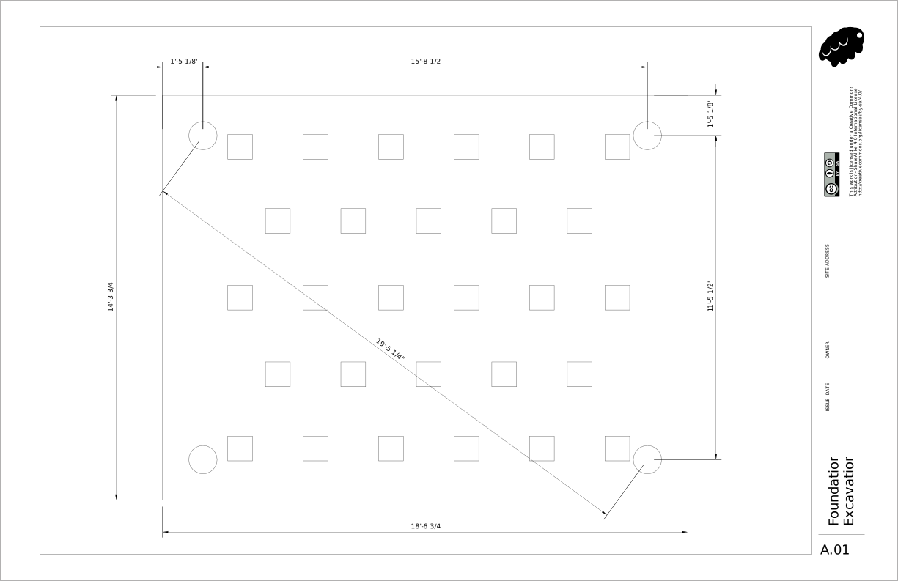
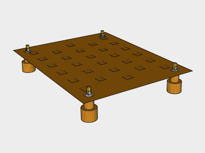
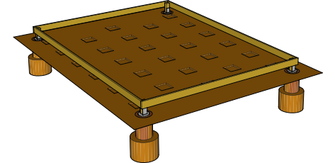
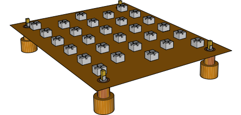
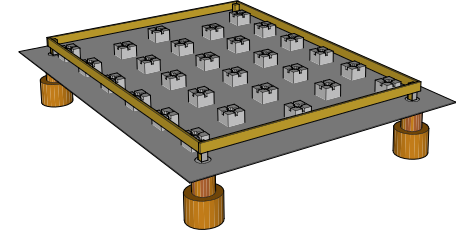
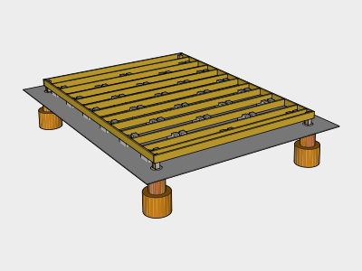
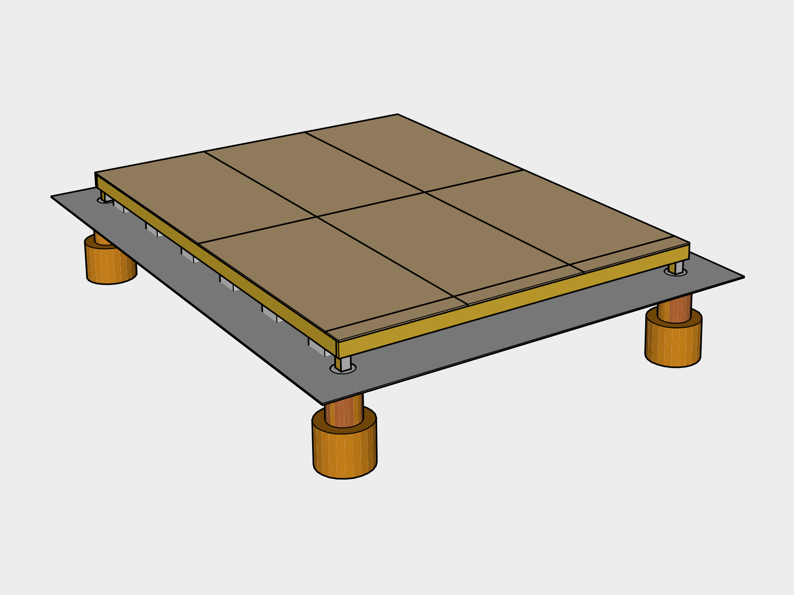

# Foundation

Pier and Block foundation was chosen for the shed since it's an uninsulated structure which needs to work in a variety of climates. Piers prevent the structure from lifting out during heavy winds, while the blocks carry the load. The depth of the piers is vary based on the frost depth location the shed will be built in, which may increase the budget.

## Survey 

### Zoning Setbacks
Check your local zoning regulations for `Setback Requirements`. Find the minimum distance from your property line and other structures before deciding on a location.

### Find Level Location
To avoid major excavation, find a location which is fairly level. You can do this easily by using a *String Line* tied between two stakes with a *String Line Level* attached to the string to gauge slope.

### Solar South

Solar south will vary based on your location. *Sun Surveyor* is a great app for smart phones that can help you determine where solar south is and how much shade a location will get on winter solstice. The shed is designed so the side to the left of the doors faces south. This is so one side of the roof can be used for solar, and the other for rainwater collection.

## 1. Excavation 

### Mark Pier Locations

Use *Marking Chalk Spray Paint* and a *Tape Measure* to roughly mark the locations of the piers. Press *Stakes* into marked corners, then measure from corner to corner and adjust the stakes until all the measurements are correct. When you're finished, pound the stakes several inches in with a *Hammer* to keep them from moving.

Use the *String Line* to connect the stakes to make a rectangle. Measure out 12 inches from the string and mark several points then use the marking spray paint to connect the points to create a box.

### Remove Grass & Debris

Carefully choose a location for a soil pile and sod pile that's at least 9 feet out of the way (you'll need that space for ladders to do roofing later).

Use the *Shovel(s)* and *Wheel Barrow* to remove any grass, shrubs or debris from the top layer of the marked out box.

### Level Ground

Attach *String Line Levels* to the strings on all four sides. Level starting roughly an inch above the ground at the highest point. Use this as a guide to remove top soil until the ground is leveled. Tamp the soil with a *Tamper*.

### Retaining Wall (avoid)

We built on an incline, and ended up with a soil ledge on one side, and had to build a retaining wall to avoid erosion. We also dug a trench for a french drain is on the inside of the retaining wall and filled it with crushed stone. This increased our build time, and building on an incline is not recommended for that reason.

### Dig Pier Holes

Rent an 8-12" *Auger* and use the *Digging Bar* and *Small Post Hole Digger* if you have rocky soil.

Dig out the bottom of the hole so it flares to create a footing. This helps resist frost heave and lift from strong winds.

The depth will need to change based on the region you build in. Correct the frost depth based on your local code.

### Gravel

Add about an inch of *All Purpose Gravel* to the bottom of every hole.

## 2. Piers 

### Rebar

In retrospect we should have added rebar into the footings for additional strength. This will be fixed in a future version.

### Pour Piers
Cut the *Concrete Tube Forms* to size using a *Hand Saw*.

Attach *3.5 Exterior Nails* to the sides of the *Cardboard Concrete Form Tubes* to the center of *2 2x4s*. The tube should hang about 12 inches up from the bottom of the footing.

Make sure to wear a *N95 Dust Mask* to avoid breathing in  concrete dust, and *Cleaning Gloves* to protect your skin for this next step.

Slowly pour *Water* over 1 *Bag of Concrete* in the *Wheel Barrow*. Mix the contents using the *Garden Hoe* and add water gradually until you have a thick consistency.

Shovel the concrete into the forms and occasionally insert the *Margin Trowel* into the concrete to remove any air pockets.

Once full, smooth out the top of the form with the *Margin Trowel*. Then insert a *Galvanized Post Base* into the form, squaring it up with the other corners, centering it with where the post should be.

## 3. Fill 

Wait a day and remove the *Cardboard Concrete Form Tubes* from around the piers. Backfill with *Compactable Fill* and tamp using the *Digging Bar*.

### Cutting Lumber

To safely cut lumber, create 2 sawhorses using 45 *2x4x8s* cut into eight 3 foot sections and inserted into 4 *Sawhorse Brackets*. Always wear *Work Gloves* and *Safety Glasses* when using electrically powered equipment.

### Cut & Insert Piers

Mark the *Treated 4x4x8s* to size using a *Carpenter's Pencil* and *Square* then cut using a *Battery Powered Hand-held Circular Saw* and insert them into the *Galvanized Post Bases*. Drill the bolt holes out using a *Battery Powered Drill* and a *1/2" diameter 6" long brad point bit*. Insert the *1/2" x 6" Galvanized Carriage Bolts* and tighten the *1/2" Galvanized Washers* and *1/2" Galvanized Nuts* with a *1/2" Socket Wrench*.

### Treated wood

Treated wood can’t be composted or burned because of its toxicity and must be thrown away. 

We’re open to alternatives to improve this design. 

## 4. Joist End Plates 

Place 2 *Treated 2x6x12s* and 2 *Treated 2x6x16s* as end plates on *Concrete Deck Blocks* and use *Shims*  and a *4' Level* to level them until they all line up with each other at the corners.

Drill the holes for the bolts and bolt the 4x4s to the end plates like you did the piers.

## 5. Deck Blocks 

Mark the longer end plates for the floor joists. 

Cut the remaining *2x6x12s* to 11' 9" to use as floor joists.

Roughly place the *Concrete Blocks* in place by inserting the floor joists into them, and aligning the joists roughly with the marks.

After each board is lined up, remove an inch of soil under each block and add *All Purpose Gravel* under each block until the joists are level with the side beams.

Carefully mark the unattached floor joists with numbers using a *Carpenter's Pencil* so you can place them back in the same place later. Then remove them for the next step.

## 6. Gravel 

Use the *Shovel* and the *Hoe* to spread a layer of *#57 Drainage Gravel* around the blocks to improve drainage.

## 7. Floor Joists 

Insert the floor joists back into place using your marks.

### Joist Connections `IRC Table 602.3(1)`

Hammer 2 *3.5" Exterior Nails* into each end of each joist.

| Placement | Technique | Nail Size | Nail Frequency / Number | Occurances | 3.5" Nails
|---|---|---|---|---|---|---|
| End Plate | End Nail | 3.5" | 2 nails | 26 | 60

## 8. Flooring Sheathing 

Load the *Battery Powered Nail Gun* with *2.5" Interior Nails*.

Lay *5/8" (19/32) Plywood* down on top of the joists end to end, nailing the corners as you go. `IRC TABLE R503.1`

Plywood should be run so the direction of the grain runs perpendicular to the joists to increase strength.

Once in place Mark a *Chalk Line* across the plywood for each joist using the nails on either end as a guide for nailing.

### Plywood Connection `IRC TABLE R602.3(1)`

Nail the plywood in using the following nailing schedule:

| Placement | Nail Size | Nail Frequency / Number | Occurances | Nails / Sheet | 2.5"  Nails
|---|---|---|---|---|---|
| Edges on Studs | 2 or 2.5" | Every 6" on center | 6 sheets | 48 | 288
| Center on Studs | 2 or 2.5" | Every 12" on center | 6 sheets | 16 | 96
|**Total**||| | |384

## Cover until next step

Place *Bricks* on *Tarp*

## Tools

### New Tools

| Item | Cost |
|---|---|
| 100' String Line | 2.98
| 4 [String Line Levels](https://en.wikipedia.org/wiki/Spirit_level#Line_level) | 5.86 
| Solar Surveyor App | 10
| Marking Spray Paint | 5.27
| 25'+ [Tape Measure](https://en.wikipedia.org/wiki/Tape_measure) | 9.88
| 4 2-ft Wooden [Stakes](https://en.wikipedia.org/wiki/Survey_stakes) | 4.97
| [Hammer](https://en.wikipedia.org/wiki/Hammer) | 4.98
| [Digging Shovel](https://en.wikipedia.org/wiki/Shovel) | 5.98
| [Wheel Barrow](https://en.wikipedia.org/wiki/Wheelbarrow) | 49.97
| [Tamper](https://en.wikipedia.org/wiki/Tamp) | 26.98
| 8" [Auger](https://en.wikipedia.org/wiki/Auger_(drill)) Rental | 50.00
| [Digging Bar](https://en.wikipedia.org/wiki/Digging_bar) | 31.97
| [Small Post Hole Digger](https://en.wikipedia.org/wiki/Post_hole_digger) | 24.97
| [Hand Saw](https://en.wikipedia.org/wiki/Hand_saw) | 9.94
| 2 [N95 Dust Mask](https://en.wikipedia.org/wiki/Dust_mask)s | 7.47
| Cleaning Gloves | 1.98
| [Hoe](https://en.wikipedia.org/wiki/Hoe_(tool)) | 15.97
| [Margin Trowel](https://en.wikipedia.org/wiki/Trowel) | 5.77
| Carpenter's Pencil
| Speed Square
| 2 Sawhorse Brackets Sets 
| Work Gloves
| Safety Glasses
| Battery Powered 7-1/4-in [Hand-held Circular Saw](https://en.wikipedia.org/wiki/Circular_saw) | 279.00
| Battery Powered Drill | 159.00
| 1/2" diameter 6" long brad point bit | 9.97
| 1/2" Socket Wrench | 26.19
| 4' Level |
| Battery Powered [Nail Gun](https://en.wikipedia.org/wiki/Nail_gun)| 399.00
| [Plumb Chalk Line](https://en.wikipedia.org/wiki/Chalk_line) | 5.97
|**Estimated Total**|**1144.07**

## Supplies

### New Supplies

| Item | Use | # | Cost |
|---|---|---|
| All Purpose Gravel 50 lb Bag || 6? | 24.90
| 1/2" x 2' Rebar (varies) || 4 | 7.88
| 3.5" Exterior Nails || 60 | 4.97
| 8"x4' Concrete Tube Forms (varies) || 2 | 19.00
| 2x4x8 || 2 | 6.22
| 5 gallon Water Jugs or Water Source ||  3 | 50.82
| Concrete 80 lb bags (varies ) || 8 | 39.76
| 4" x 4" Galvanized Post Base || 4 | 45.48
| 1/4 Cubic Yard of Compactable Fill / Top Soil | | | 9.42
| Treated 4x4x8 || 1 | 7.98 
| 1/2" x 6" Galvanized Carriage Bolts || 16 |40.48
| 1/2" Galvanized Washers || 16 | 5.28
| 1/2" Galvanized Nuts || 16 | 6.08
| Treated 2x6x12 || 14 | 124.32
| Treated 2x6x16 || 2 | 23.14
| Concrete Deck Blocks || 28 | 193.20
| Shims || | 4.95
|Cubic Yard of #57 Drainage Gravel|  | 1 | 29.00 | 
| 2.5" Interior Nails for Nail Gun || 384 | 37.97
| 4x8 5/8" (19/32) Plywood || 7 |141.19
| Bricks
| Tarp ||  1
|**Estimated Total**|||**822.04**

Total cost does not include Tax or Delivery fees. Materials noted as "(varies)" depends on the frost depth for your location.
