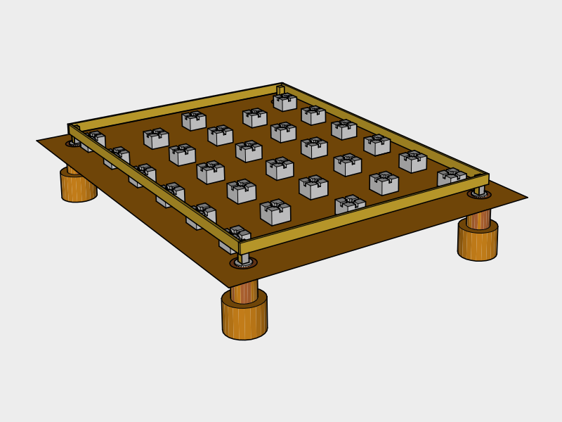

# Foundation

## 1. Intro (Slab might be better)
This design uses concrete deck blocks for support with scorner piers to hold down the structure during high winds.

In retrospect, concrete slab seems like it's a better choice and will likely be the only major revision to our shed design. We used treated wood because of the proximity to the ground (which is not compostable or repurposable). The bottom feels too exposed and may threaten the lifespan of the rest of the structure. In the future, we'll likely contract out the excavation and pouring of monolithic slab and are interested in [Roman Concrete](https://en.wikipedia.org/wiki/Roman_concrete#Modern_use).

Keep reading if your interested in what we did, and expect an update in the future.

## 2. Survey

### Zoning Setbacks
Check your local zoning regulations for `Setback Requirements`. Find the minimum distance from your property line and other structures before deciding on a location.

### Find Level Location
To avoid major excavation, find a location which is fairly level. You can do this easily by using a *String Line* tied between two stakes. Once you've found a rough location, attach a *String Line Level* to the string to gauge how much excavation will be needed.

## 3. Excavation

### Mark Pier Locations

Use *Marking Chalk Spray Paint* and a *Tape Measure* to roughly mark the locations of the piers. Press *Stakes* into marked corners, then measure from corner to corner and adjust the stakes until all the measurements are correct. When you're finished, pound the stakes several inches in with a *Hammer* to keep them from moving.

Use the *String Line* to connect the stakes to make a rectangle. Measure out 12 inches from the string and mark several points then use the marking spray paint to connect the points to create a box.

### Remove Grass & Debris

Carefully choose a location for a soil pile and sod pile that's at least 9 feet out of the way (you'll need that space for ladders to do roofing later).

Use the *Shovel(s)* and *Wheel Barrow* to remove any grass, shrubs or debris from the top layer of the marked out box.

### Level Ground

Attach *String Line Levels* to the strings on all four sides. Level starting roughly an inch above the ground at the highest point. Use this as a guide to remove top soil until the ground is leveled.

### Retaining Wall (avoid)

We built on an incline, and ended up with a soil ledge on one side, and had to build a retaining wall to avoid erosion. We also dug a trench for a french drain on the inside of the retaining wall and filled it with crushed stone. This increased our build time, and building on an incline is not recommended for that reason. This could also be solved by using a slab foundation.

### Dig Pier Holes

Rent an 8-12" *Auger* and use the *Digging Tools* if you have rocky soil.

Dig out the bottom of the hole so it flares to create a footing. This helps resist frost heave and lift from strong winds.

## 4. Piers

### Rebar

In retrospect we should of added rebar into the footings for additional strength. This could also be solved by using a slab foundation.

### Pour Piers
Cut the *Concrete Tube Forms* to size using a *Hand Saw*.

Nail the sides of the *Cardboard Concrete Form Tubes* to the center of 2 2x4s. The tube should hang about 12 inches up from the bottom of the footing.

Make sure to wear a *Respiratory Mask* to avoid breathing in  concrete dust, and *Cleaning Gloves* to protect your skin for this next step.

Slowly pour *Water* over 1 *Bag of Concrete* in the *Wheel Barrow*. Mix the contents using the *Garden Hoe* and add water gradually until you have a thick consistency.

Shovel the concrete into the forms and occasionally insert the *Margin Trowel* into the concrete to remove any air pockets.

Once full, smooth out the top of the form with the *Margin Trowel*. Then insert a *Galvanized Post Base* into the form, squaring it up with the other corners, centering it with where the post should be.

### Fill

Wait a day and remove the *Cardboard Concrete Form Tubes* from around the piers. Backfill with *Compactable Fill* and tamp using the *Digging Bar*.

### Cut & Insert Piers

Cut the *Treated 4x4x8s* to size and insert them into the *Galvanized Post Bases*

## 5. Joist End Plates

Place the end plates temporarily on two *Concrete Deck Blocks* and use *Shims* to level them until they all line up with each other at the corners.

Drill the holes for the bolts. Then bolt the 4x4s to the end plates.

## 6. Blocks

Mark the longer end plates for the floor joists. 

Roughly place the *concrete blocks* in place by inserting the floor joists into them, and aligning the joists roughly with the marks.

After each board is lined up, remove an inch of soil under each block and add *All Purpose Gravel* under each block until the joists are level with the side beams.

Carefully mark the unattached floor joists with numbers so you can place them back in the same place later. Then remove them for the next step.

## 7. Gravel

Use the *Shovel* and the *Hoe* to spread a layer of gravel around the blocks to improve drainage.

## 8. Floor Joists

Insert the floor joists back into place using your marks.

### Joist Connections `IRC Table 602.3(1)`

Hammer 2 *3.5" Exterior Nails* into each end of each joist.

| Placement | Technique | Nail Size | Nail Frequency / Number | Occurances | 3.5" Nails
|---|---|---|---|---|---|---|
| End Plate | End Nail | 3.5" | 2 nails | 26 | 60

## 9. Plywood Flooring

Load the *Nail Gun* with *2.5" Nails*.

Lay *5/8" (19/32) Plywood* down on top of the joists end to end, nailing the corners as you go. `IRC TABLE R503.1`

Plywood should be run so the direction of the grain runs perpendicular to the joists to increase strength.

Once in place Mark a *Chalk Line* across the plywood for each joist using the nails on either end as a guide for nailing.

### Plywood Connection `IRC TABLE R602.3(1)`

Nail the plywood in using the following nailing schedule:

| Placement | Nail Size | Nail Frequency / Number | Occurances | Nails / Sheet | 2.5"  Nails
|---|---|---|---|---|---|
| Edges on Studs | 2 or 2.5" | Every 6" on center | 6 sheets | 48 | 288
| Center on Studs | 2 or 2.5" | Every 12" on center | 6 sheets | 16 | 96
|**Total**||| | |384

## 10. Cover until next step

Place a 
Bricks on tarp

## Supplies

### Materials Needed

|Item | Amount | Note | 2017 Cost
|---|---|---|---|
| Concrete Deck Blocks | 28 | Heavy | 193.20
| Cubic Yard of #57 Drainage Gravel| 1 | Heavy | 29.00
| 40 lb bags of Compactable Fill / Top Soil | 6 | | 9.42
| All Purpose Gravel 50 lb Bag | 6 | Heavy | 24.90
| Concrete 80 lb bags | 8 | Heavy, Cost Varies | 39.76
| 8" x 4' Concrete Tube Forms | 2 | Cost Varies | 19.00
| 1/2" x 2' Rebar | 4 | Cost Varies | 7.88
| 5 gallon Water Jugs or Water Source |  3 | Cost Varies |50.82
| 4" x 4" Galvanized Post Base | 4 | | 45.48
| 2x4x8 | 2 | | 6.22
| Treated 2x6x12 | 14 | Large | 124.32
| Treated 2x6x16 | 2 | Large | 23.14
| Treated 4x4x8 | 1 | | 7.98 
| 4x8 5/8" (19/32) Plywood | 7 || 141.19
| 2.5" Interior Nails for Nail Gun | 384 | | 37.97
| 3.5" Exterior Nails | 60 | | 4.97
| Shims | | | 4.95
| 1/2" x 6" Galvanized Carriage Bolt | 16 ||40.48
| 1/2" Galvanized Washer | 16 | | 5.28
| 1/2" Galvanized Nut | 16 | | 6.08
|**Estimated Total**|||**822.04**

Total cost does not include Tax or Delivery fees. Materials noted as "Cost Varies" depends on the frost depth for your location.

### Tools Needed

|Item | Amount | 2017 Cost
|---|---|---|---|
| [Hammer](https://en.wikipedia.org/wiki/Hammer) | 1 | 4.98
| [Hand Saw](https://en.wikipedia.org/wiki/Hand_saw) | 1 | 9.94
| [Hoe](https://en.wikipedia.org/wiki/Hoe_(tool)) | 1 | 15.97
| [Hand-held Circular Saw](https://en.wikipedia.org/wiki/Circular_saw) (Battery Powered)| 1 | 279.00
| [Nail Gun](https://en.wikipedia.org/wiki/Nail_gun)  (Battery Powered)| 1 | 399.00
| Marking Spray Paint | 1 | 5.27
| 2 ft [Stakes](https://en.wikipedia.org/wiki/Survey_stakes) | 4 | 4.97
| [25' Tape Measure](https://en.wikipedia.org/wiki/Tape_measure) | 1 | 9.88
| 100' String Line | 1 | 2.98
| [String Line Levels](https://en.wikipedia.org/wiki/Spirit_level#Line_level) | 4 | 5.86
| [Plumb Chalk Line](https://en.wikipedia.org/wiki/Chalk_line) | 1 | 5.97
| [8" Auger](https://en.wikipedia.org/wiki/Auger_(drill)) | Rent | 50.00
| [Small Post Hole Digger](https://en.wikipedia.org/wiki/Post_hole_digger) | 1 | 24.97
| [Digging Bar](https://en.wikipedia.org/wiki/Digging_bar) | 1 | 31.97
| [Digging Shovel](https://en.wikipedia.org/wiki/Shovel) | 1 | 5.98
| [Margin Trowel](https://en.wikipedia.org/wiki/Trowel) | 1 | 5.77
| [Wheel Barrow](https://en.wikipedia.org/wiki/Wheelbarrow) | 1 | 49.97
| [N95 Dust Mask](https://en.wikipedia.org/wiki/Dust_mask) | 2 | 7.47
| Pair of Cleaning Gloves | 1 | 1.98
| Drill | 1| 159.00
| Bit for Drilling Bolt holes | 1 | 9.97
| 1/2" Socket Wrench | 1| 26.19
