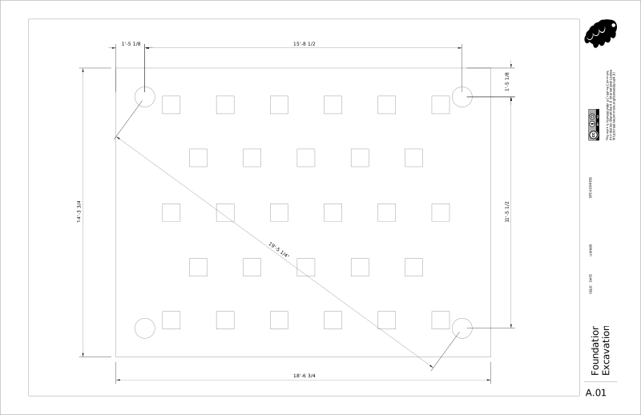
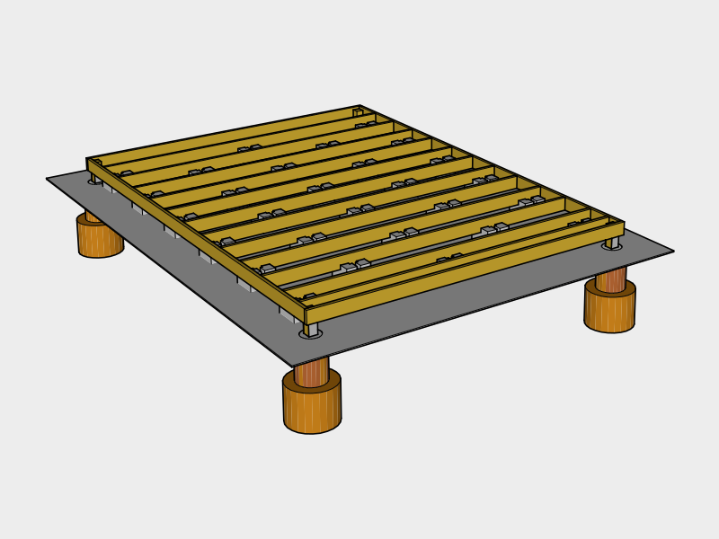

# Foundation

Concrete deck blocks for support with corner piers as hold downs.

## Materials Needed

|Item | Amount | Note |
|---|---|---|---|
| Concrete Deck Blocks | 28 | Heavy
| Concrete 80 lb bags | 8 | Heavy
| All Purpose Gravel 50 lb Bag | 6 | Heavy
| #57 Drainage Gravel (cubic yards) | 1 | Heavy
| Compactable Fill | 
| Concrete Tube Forms | 4 
| Post Beam Connectors | 4
| 5 gallon Water Jugs or Water Source |  3
| 2x4x8 | 2
| Treated 2x6x12 | 14 | Large
| Treated 2x6x16 | 2 | Large
| Treated 4x4x8 | 1
| 4x8 5/8" (19/32) Plywood | 7 
| 2.5" Nails for Nail Gun | 384
| 3.5" Exterior Nails | 60
| Shims
| 1/2" x 6" Galvanized Carriage Bolt | 16
| 1/2" Galvanized Washer | 16
| 1/2" Galvanized Nut | 16

## Tools Needed

|Item | Amount |
|---|---|---|---|
| [Hammer](https://en.wikipedia.org/wiki/Hammer) | 1
| [Hand Saw](https://en.wikipedia.org/wiki/Hand_saw) | 1
| [Hoe](https://en.wikipedia.org/wiki/Hoe_(tool)) | 1
| [Hand-held Circular Saw](https://en.wikipedia.org/wiki/Circular_saw) | 1
| [Nail Gun](https://en.wikipedia.org/wiki/Nail_gun) | 1
| Marking Chalk Spray Paint | 1
| 2 ft [Stakes](https://en.wikipedia.org/wiki/Survey_stakes) | 4
| [Tape Measure](https://en.wikipedia.org/wiki/Tape_measure) | 1
| String Line | 1
| String Line Levels | 4
| [Plumb Chalk Line](https://en.wikipedia.org/wiki/Chalk_line) | 1
| [Auger](https://en.wikipedia.org/wiki/Auger_(drill)) | Rent 1
| [Post Hole Digger](https://en.wikipedia.org/wiki/Post_hole_digger) | 1
| [Digging Bar](https://en.wikipedia.org/wiki/Digging_bar) | 1
| [Digging Shovel](https://en.wikipedia.org/wiki/Shovel) | 1
| Margin Trowel | 1
| [Wheel Barrow](https://en.wikipedia.org/wiki/Wheelbarrow) | 1
| [N95 Dust Mask](https://en.wikipedia.org/wiki/Dust_mask) | 2
| Cleaning Gloves
| Drill
| Bit for Drilling Bolt holes
| Wrench

## Survey

### Zoning Setbacks
Check your local zoning regulations for `Setback Requirements` to find the minimum distance from your property line and other structures before deciding on a location.

### Find Level Location
To avoid major excavation, find a location which is fairly level. You can do this easiley by using the *String Line* tied between two stakes. Once you've found a rough location, attach a *String Line Level* to the string to gauge how much excavation will be needed.

## Excavation

### Mark Pier Locations

Use *Marking Chalk Spray Paint* and a *Tape Measure* to roughly mark the locations of the piers. Press *Stakes* into marked corners, then measure from corner to corner and adjust the stakes until all the measurements are correct. When your finished pound the stakes several inches in with a *Hammer* to keep them from moving.

Use the *String Line* to connect the stakes to make a square. Measure out 12 inches from the string and mark several points then use the marking spray paint to connect the points to create a box.

### Remove Grass & Debris

Carefully choose a location for a soil pile and sod pile that's well out of the way.

Use the *Shovel(s)* and *Wheel Barrow* to remove any grass, shrubs or debris from the top layer of the marked out box.

### Level Ground

Attach *String Line Levels* to the four sides on the string and level starting roughly an inch above the ground at the highest point. Use this as a guide to remove top soil until the ground is leveled.

### Retaining Wall

If building on an incline you may end up with a soil ledge on one side and will need to build a retaining wall to avoid erosion. You may also want to dig a trench for a french drain on the inside of the retaining wall and filling it with crushed stone. This will increase your build time and is not recommended for that reason.

### Dig Pier Holes

Rent an *Auger* and use the *Digging Tools* if you have rocky soil.

Dig out the bottom of the hole so it flares out at the bottom to resist frost heave and lift from strong winds.

## Piers

### Pour Piers
Cut the tube to size using a *Hand Saw*.

Nail the sides of the *Cardboard Concrete Form Tubes* to the center of 2 2x4s so the tube is about 12 inches up from the bottom of the footing.

Slowly pour *Water* over 1 *Bag of Concrete* in the *Wheel Barrow* and mix using the *Garden Hoe* until you have a thick consistency.

Make sure to wear a *Respitory Mask* to avoid breathing in concrete dust, and *Cleaning Gloves* to protect your skin.

Shovel the concrete into the forms and occasionally insert the *Margin Trowel* into the concrete to remove any air pockets.

Once full, smooth out the top of the form with the *Margin Trowel* and insert a *Galvanized Post Base* into the form, lining it up center with where the post should be.

### Fill

Wait a day and remove the *Cardboard Concrete Form Tubes* from around the piers. Backfill with *Compactable Fill* and tamp using the *Digging Bar*.

### Cut & Insert Piers

Cut the *Treated 4x4x8s* to size and insert them into the *Galvanized Post Bases*

## Joist End Plates

Place the end plates on temporarily on two *Concrete Deck Blocks* and use *Shims* to level them until they all line up with each other at the corners.

Drill the holes for the bolts then bolt the 4x4s to the post bases, and bolt the side beams to the post bases.

## Blocks

Mark the long end plates for the floor joists. Roughly place the *concrete blocks* in place by inserting the floor joists into them, and aligning the joists roughly with the marks.

After each board is lined up, remove an inch of soil under each block and add *All Purpose Gravel* under each block until the joists are level with the side beams.

Carefully mark the unattached floor joists so you can place them back where they belong and remove them for the next step.

## Gravel

Use the *Shovel* and the *Hoe* to spread a layer of gravel around the blocks to improve drainage.

## Floor Joists

Insert the floor joists back into place using your marks.

### Joist Connections `IRC Table 602.3(1)`

Hammer 2 *3.5" Exterior Nails* into each end of each joist.

| Placement | Technique | Nail Size | Nail Frequency / Number | Occurances | 3.5" Nails
|---|---|---|---|---|---|---|
| End Plate | End Nail | 3.5" | 2 nails | 26 | 60

## Plywood Flooring

Load the *Nail Gun* with *2.5" Nails*.

Lay *5/8" (19/32) Plywood* down on top of the joists end to end, nailing the corners as you go. `IRC TABLE R503.1`

Mark a *Chalk Line* across the plywood for each joist using the nails on either end as a guide.  

### Plywood Connection `IRC TABLE R602.3(1)`

Nail the plywood in using the following nailing schedule:

| Placement | Nail Size | Nail Frequency / Number | Occurances | Nails / Sheet | 2.5"  Nails
|---|---|---|---|---|---|
| Edges on Studs | 2 or 2.5" | Every 6" on center | 6 sheets | 48 | 288
| Center on Studs | 2 or 2.5" | Every 12" on center | 6 sheets | 16 | 96
|**Total**||| | |384

## Cover until next step

Bricks on tarp