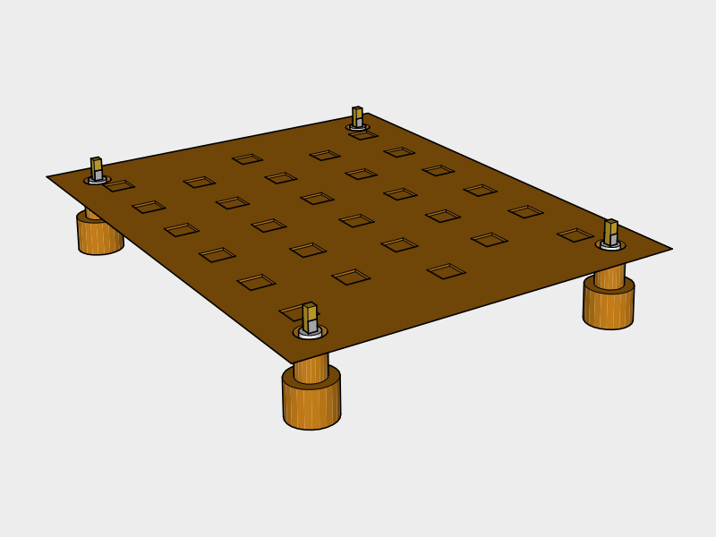

## Foundation

Need:

3 Deck Blocks
String
Measuring Tape
Concrete Tubes
Anchor Bolts

### Foundation

at least 6" above grade

Mix concrete blocks and corner piers. Piers act as hold downs, blocks add support.

#### Measure Location

#### Dig holes

Rent an auger or use these tools:

* Small Clamshell Digger
* Digging Bar
* Tile Spade
* Shovel

#### Piers

Dig out the bottom of the hole so it flares out at the bottom to resist frost heave.

Nail the sides of the cardboard concrete form to the center of a grid of 2x4s so the tube about 12 inches up from the bottom of the footing.

Add soil around the posts to keep run off away from the posts.

#### Blocks

#### Gravel

#### Floor Joists

Treated

#### Posts

#### Estimate

|Item | Amount |
|---|---|---|---|
| Concrete Deck Block | 30
| Concrete Tube Forms | 4 
| 4x4 Post Base | 4
| Gravel | 1 yard
| Concrete 80 lb bags | 4
| Water | 22.4 liters
| 2x6x12 treated | 14
| 2x6x16 treated | 2
| 4x4x8 treated | 1

### Plywood Flooring

5/8 (19/32) Plywood (TABLE R503.1)

| Item | Amount |
|---|---|---|---|
|4x8 5/8" | 7

#### Estimate

* 24' edge length for each 4x8 = 48 nails per sheet
* Two 8' center lengths for each 4x8 = 16 nails per sheet

| Placement | Nail Size | Nail Frequency / Number | Occurances | 2.5"  Nails
|---|---|---|---|---|
| Edges on Studs | 2 or 2.5" | Every 6" on center | 6 sheets | 288
| Center on Studs | 2 or 2.5" | Every 12" on center | 6 sheets | 96
|**Total**||| | 384
