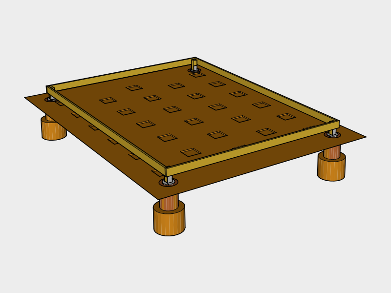

# Foundation

Concrete deck blocks for support with corner piers as hold downs.

## Materials Needed

* 28 Deck Blocks
* 2 5 gallon Water Jugs or Water Source
* 4 Cardboard Concrete Form Tubes
* 4 Post Beam Connectors
* 8 2 ft 2x4s
* Exterior Nails

## Tools Needed

* Hammer
* Hand Saw
* Garden Hoe

### Surveying Tools
* Marking Spray Paint
* 4 or more 2 ft Stakes
* Measuring Tape
* String on Reel
* 4 String Levels

### Digging Tools
* Small Clamshell Digger
* Digging Bar
* Shovel(s)

### Concrete Pouring Tools
* Tile Spade
* Wheel Barrow
* Respitory Mask

## Survey

### Zoning Setbacks
Check your local zoning regulations for `Setback Requirements` to find the minimum distance from your property line and other structures before deciding on a location.

### Find Level Location
To avoid major excavation, find a location which is fairly level. You can do this easiley by using the *String on Reel* tied between two stakes. Once you've found a rough location, attach a *String Level* to the string to gauge how much excavation will be needed.

## Excavation

### Mark Pier Locations

Use *Marking Spray Paint* and a *Measuring Tape* to roughly mark the locations of the piers. Press *Stakes* into marked corners, then measure from corner to corner and adjust the stakes until all the measurements are correct. When your finished pound the stakes several inches in with a *Hammer* to keep them from moving.

Use the *String on Reel* to connect the stakes to make a square. Measure out 12 inches from the string and mark several points then use the marking spray paint to connect the points to create a box.

### Remove Grass & Debris

Carefully choose a location for a soil pile and sod pile that's well out of the way.

Use the *Shovel(s)* and *Wheel Barrow* to remove any grass, shrubs or debris from the top layer of the marked out box.

### Level Ground

Attach *String Levels* to the four sides on the string and level starting roughly an inch above the ground at the highest point. Use this as a guide to remove top soil until the ground is leveled.

### Retaining Wall

If building on an incline you may end up with a soil ledge on one side and will need to build a retaining wall to avoid erosion. You may also want to dig a trench for a french drain on the inside of the retaining wall and filling it with crushed stone. This will increase your build time and is not recommended for that reason.

### Dig Pier Holes

Rent an auger and use the *Digging Tools* if you have rocky soil.

Dig out the bottom of the hole so it flares out at the bottom to resist frost heave and lift from strong winds.

##Piers

### Pour Piers
Cut the tube to size using a *Hand Saw*.

Nail the sides of the *Cardboard Concrete Form Tubes* to the center of 2 2x4s so the tube is about 12 inches up from the bottom of the footing.

Slowly pour *Water* over 1 *Bag of Concrete* in the *Wheel Barrow* and mix using the *Garden Hoe* until you have a thick consistency.

Make sure to wear a *Respitory Mask* to avoid breathing in concrete dust, and 

Then shovel the concrete 

###Fill

## Joist Side Beams

## Blocks

## Gravel

Use the *Garden Hoe* to spread a layer of gravel around the blocks to improve drainage.

## Floor Joists

Treated

Garden Hoe

#### Estimate

|Item | Amount |
|---|---|---|---|
| Concrete Deck Block | 30
| Concrete Tube Forms | 4 
| 4x4 Post Base | 4
| Gravel | 1 yard
| Concrete 80 lb bags | 4
| Water | 22.4 liters
| 2x6x12 treated | 14
| 2x6x16 treated | 2
| 4x4x8 treated | 1

## Plywood Flooring

5/8 (19/32) Plywood (TABLE R503.1)

| Item | Amount |
|---|---|---|---|
|4x8 5/8" | 7

#### Estimate

* 24' edge length for each 4x8 = 48 nails per sheet
* Two 8' center lengths for each 4x8 = 16 nails per sheet

| Placement | Nail Size | Nail Frequency / Number | Occurances | 2.5"  Nails
|---|---|---|---|---|
| Edges on Studs | 2 or 2.5" | Every 6" on center | 6 sheets | 288
| Center on Studs | 2 or 2.5" | Every 12" on center | 6 sheets | 96
|**Total**||| | 384
