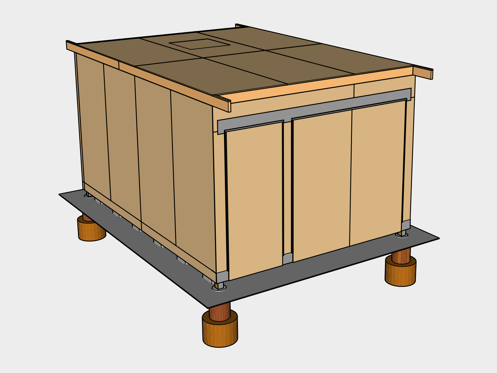
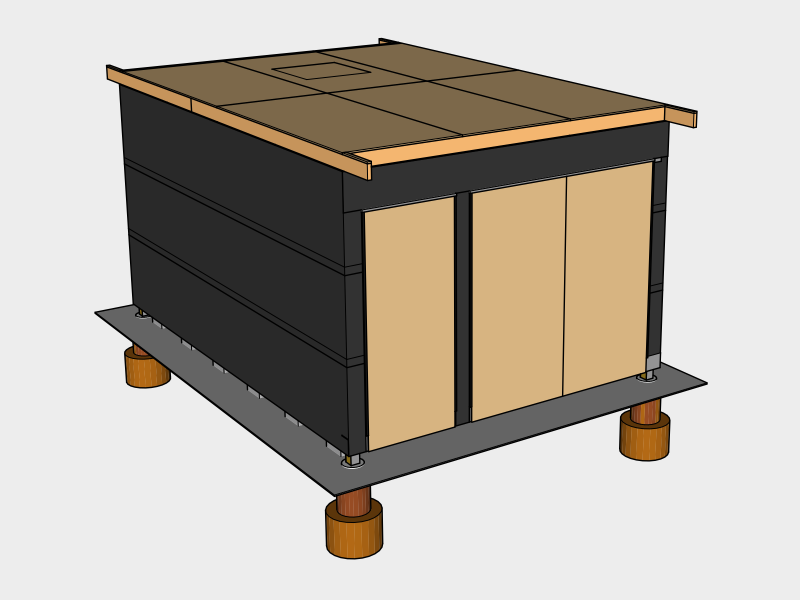

# Wall Structure

## 1. Framing 

### Build Walls
Build the west back wall (Blueprint B.01A) first using the shed floor as a surface. Cut *2x4x92 5/8"* to size using a *Battery Powered Handheld Circular Saw*. Mark the top and bottom *2x4x12* plates using a *Carpenter's Pencil* and *Measuring Tape* and nail them together using a *Battery Powered Nail Gun*. Use a *Hammer* to finish driving any nails that stick out. Stand up the wall and nail spare *2x4s* at about a 45 degree angle on either side to the end of the floor joists while leveling using a *4' Level*. Next stand up the north/south walls (Blueprint B.01B), and finally the other east/west wall (Blueprint B.01C).

### Stud & Header Nail Fastening `IRC Table 602.3(1)`

| Placement | Technique | Size | Frequency | Occurrences 
|---|---|---|---|---|
| 2 studs back to back | Face Nail | 3" | 24" on center | 3 (12 Nails)
| Studs Abutting at corners | Face Nail  | 3.5" | 12" on center | 4 (32 Nails)
| Top or Bottom Plate to Stud| End Nail | 3.5" | 2 nails | 82 (164 Nails)
|**Total**| | | | 12 3" Nails,  196 3.5" Nails

### Headers `IRC TABLE R502.5(1)`

Sandwich *5/8" Plywood* between *2 2x12s* and attach them *Face Nail* to build the headers which support the wall above the doorways before installing them in the wall.

#### Header Fastening

| Placement  | Size | Frequency | Occurrences 
|---|---|---|---|
| Header with *5/8" Plywood Spacer* | 3.5" | 16" on center along each edge | 260" length (18 Nails)

## 2. Top Plate 

Walls must be capped with a second top plate, offset at least 24 inches at joints (IRC 602.3.2). Overlap the corners so they overlap the wall joints. Attach them by nailing *Face Nail* downwards stepping on a *8 ft Step Ladder*.

### Top Plate Fastening `IRC Table 602.3(1)`

| Placement | Nail Size | Frequency | Occurances 
|---|---|---|---
| Double top plates | 3" | 24" on center | 55' (28 Nails)
| Double top plates in lapped area. | 3.5" | 8 nails 
| Top plates, overlaps at corners | 3" | 2 nails | 4 (8 Nails)
|**Total**||| 36 Nails | 

## 3. Sheathing 

The structure will be flexible when it's just studs. *3/8" Plywood* sheathing adds shear strength. Confirm everything's level while installing the sheathing.

*Hammer* *3.5" nails* lightly in between each panel. This will create an 1/8 inch gap between boards to allow for expansion and prevent buckling.

### Sheathing Fastening

* 24' edge length for each 4x8 = 48 nails per sheet
* Two 8' center lengths for each 4x8 = 16 nails per sheet

| Placement | Nail Size | Frequency | Occurrences
|---|---|---|---|
| Edges on Studs | 2 or 2.5" | Every 6" on center | 13 sheets (624 Nails)
| Center on Studs | 2 or 2.5" | Every 12" on center | 13 sheets (208 Nails)
|**Total**|||832 Nails

## 4. Ceiling Joists 

*2x6 Joists* should just about line up with the wall studs, 16 inches on center `IRC Table 802.4(1)`. Mark the end plates first, then prop up the joists over the ceiling span. Be careful not to stand in the shed while you do this in case the joists fall. Frame enough to form a box and toe nail the box into place. This should give you enough structure to add in the remaining joists.

### Joist Fastening `IRC Table 602.3(1)`
No blocking is needed because the distance between the raised top plate and the top of the parallel rafter is 7 & 1/8".  (IRC 602.10.6.2). The ends of each joist must touch the top plate for at least 1.5 inches (IRC 802.6).

| Placement | Technique | Nail Size | Frequency | Occurances
|---|---|---|---|---|
| Joists to top plate, one on each side down into top plate |  Toe Nail | 2.5" | 3 nails | 30 (60 Nails)
| End Plate | End Nail | 3.5" | 2 nails | 30 (60 Nails)
|**Total**| |||60 2.5" Nails 60 3.5" Nails

## 5. Ceiling Sheathing 

Lay one sheet up first and secure it to the joists enough to be able to get on top of it and finish fastening. Have one person pass sheets up while the other fastens. For the access hole lay the sheet on before fastening and mark the edges of the hole from the bottom. Measure out 3/4" from your line to increase the panel size and cut it out with the *Circular Saw*.

### Sheathing Fastening

**Number of Nails**

* 24' edge length for each 4x8 = 48 nails per sheet
* Two 8' center lengths for each 4x8 = 16 nails per sheet

| Placement | Nail Size | Frequency | Occurrences
|---|---|---|---|
| Edges on Studs | 2 or 2.5" | Every 6" on center | 7 sheets (336 Nails)
| Center on Studs | 2 or 2.5" | Every 12" on center | 7 sheets (112 Nails)
|**Total**||| 448 Nails

## Cover with Tarp

This is a good time to figure out how to cover the structure with a tarp so you are protected and can work towards prepping the framing for the roof. We tied a tarp down with 6 stakes and some rope.

## 6. Door Jambs 

Finish the 1x6s using the Shou Sugi Ban technique. Install them 3/4" out from the doorway so it will match up with the rain screen later. 

### Wood Burning (Shou Sugi Ban)
Wearing proper attire, using a *Propane Torch* attached to a *Propane Tank* until the surface begins to char. Avoid plastic or loose hanging clothing. Once cool, brush the soot off with a *Deck Brush*, you may want to wear a mask. Wash the remaining soot off with a *Handheld Sprayer* filled with water. Once dry, coat the wood with an oil (we used tung oil) using a rag (rip up an old towel) and protective gloves. Let the oil dry before installing. Hang up used rags outside to dry before throwing them away, rags soaked in tung oil can spontaneously combust.

You can measure and precut the boards before burning & oiling them or you can cut them afterwards and use a *Butane Torch* loaded with *Butane* to touch up the exposed areas.

## 7. Door Flashing 

Cut a roll of *Flashing* for the top and bottom of the doorway. Notch it so it can fold into place and overlap the edges. Place a board over it and hammer the board to shape the flashing.

## 8. Doors 

Build the doors and insert them into place using *Shims* to create some spacing to make sure they fit and hold them in place. Insert the *Hinges* into the gap and mark where they should go on the jam and the door. also mark the hinge for distance it should extend out. Make sure the hinge pin extends past the jam so the doors can open 180 degrees.

This door installation will be temporary to make the shed lockable until you can finish the siding.

Use a *2 1/8-inch Hole Saw Bit* to drill a hole for a deadbolt. Use a *1-inch Hole Saw Bit* to drill the holes needed for the bolt latch.

Install 1x2 door stop trim on the inside of the doors to keep them from swinging through the frame.

## 9. Wall Felt 

Install from the bottom up overlap horizontally 4 at least inches and vertically 2 inches. Use a *Hammer Tacker* to get the paper up and hammer in *Metal Cap Nails* every 6 feet to keep the paper from blowing off. Install spare *Felt Paper* on the doors to protect them temporarily until the siding can be installed over top. 

## Tie-Downs

Using a *Battery-Powered Drill*, drill through the bottom plates and into the floor joists using a *1/2" Drill Bit* a few inches from the end of each cut and once in the center of the western wall. Insert a *1/2" x 4" Galvanized Hex Lag Screw* with a  *1/2" Washer* into each hole and tighten using a *3/4" Ratchet Bit* inserted into a *Battery-Powered Impact Driver* with a *1/4" Male Hex to 1/4" Square Drive Adapter*. This will help keep the framing from pulling off in high-winds.

## Cover until next step

## Tools

### Existing Tools

| Item | Amount | Use | Chapter
|---|
| Battery Powered Handheld Circular Saw 
| [Carpenter's Pencils] (https://en.wikipedia.org/wiki/Carpenter_pencil) with sharpener | 1
| Measuring Tape
| Battery Powered Nail Gun 
| Hammer |
| Speed Square 
| 4' Level | 1

| Battery-Powered Drill | 1 |

### New Tools

| Item | # | Cost
|---|---|
| 8' Step Ladder | 1
| [Large Propane Torch](https://en.wikipedia.org/wiki/Propane_torch)
| [20 lb Propane Tank](https://en.wikipedia.org/wiki/Propane)
| Handheld Weed Sprayer
| [Butane Torch](https://en.wikipedia.org/wiki/Butane_torch)
| Butane Canister
| Deck Brush |
| [Hammer Tacker](https://en.wikipedia.org/wiki/Hammer_tacker)
| 3/4" Ratchet Bit | 1
| 1/4" Male Hex to 1/4" Square Drive Adapter | 1
| 1/2" Drill Bit | 
| Solar Surveyor App | 1 | $10

## Supplies

### New Supplies

| Item | # | Cost |
|---|---|---|
| 2x4x92 5/8" | 51
| 2x4x12 | 3
| 2x4x8 | 10
| 4x8 5/8" plywood | 7
| 2x12x8 | 3
| 3" Interior Nails for nail gun |
| 3.5" Interior Nails for nail gun |
| 4x8 3/8" plywood | 16
| 2x6x12 | 16
| 2x6x8 | 4

| Post Frame Hangers | 4
| 1x2x8
| 1x6x8 Cedar | 6
| Deadbolt for Door | 1
| 6 in Galvanized Barrel Bolt | 3
| Hinges | 6
| Handle | 1
| Wall Felt | 558 sq ft
| Metal Cap Nails 
| Stakes | 6
| Rope | 
| 1/2" x 4 in. Galvanized Hex Lag Screw | 11
| 1/2" Galvanized Washer | 11
| T50 Staples |
| [Tung Oil](https://en.wikipedia.org/wiki/Tung_oil)
| Rags
| [Thick / Long Rubber Gloves](https://en.wikipedia.org/wiki/Rubber_glove)

### Existing Supplies

| Item | # | Cost |
|---|---|---|
| 2.5" Interior Nails for nail gun | 