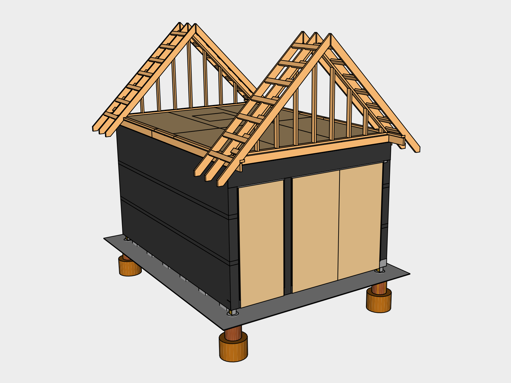
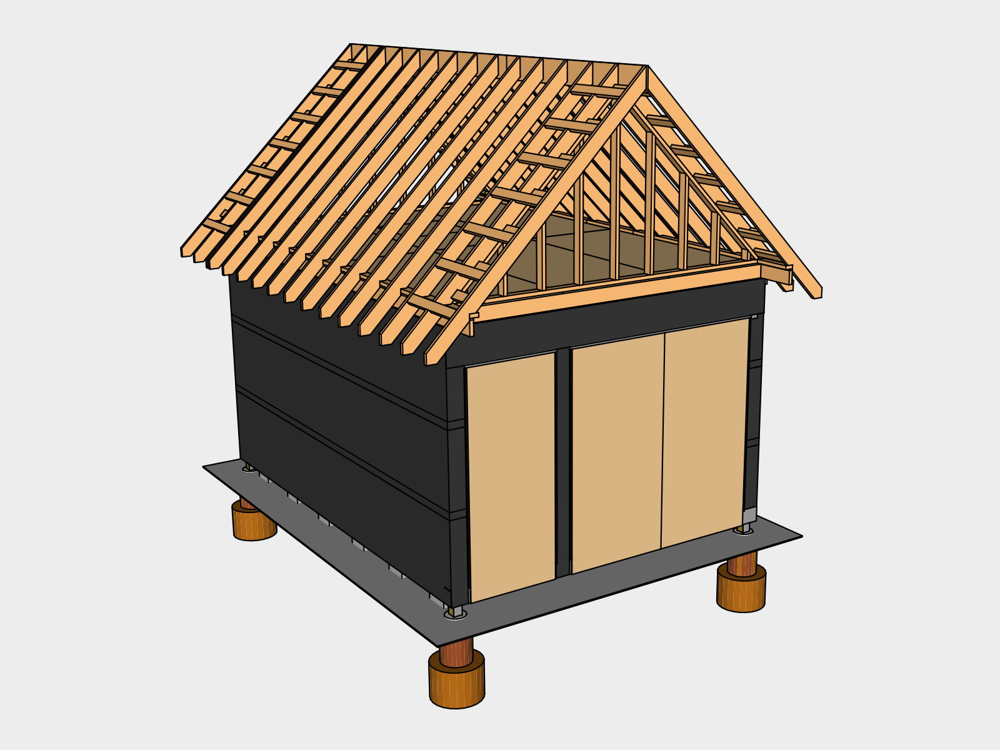
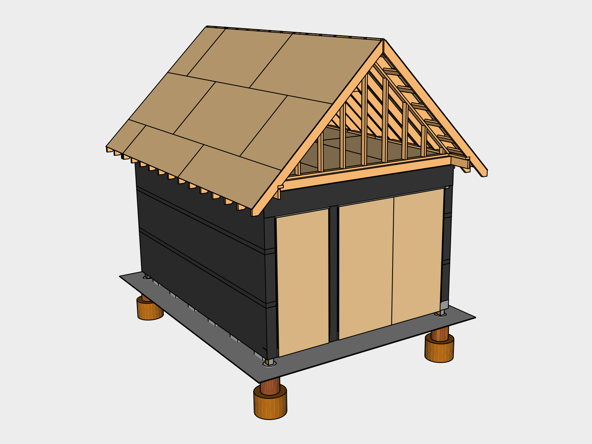

# Roof Structure

The roof is designed with a steep 45 degree (12:12) pitch to shed water and debris quickly so it will last longer. It has long overhangs to help keep the siding dry.

Wait to start the roof until you have a few dry days to work on it. It will be hard to cover until at least the roof sheathing is up because of wind. Precut the rafters and assemble the gables in advance. Now that the shed is enclosed, you can store the supplies for the roof inside. To help with organization we recommend building a simple lumber rack to accommodate the larger materials. 

## 01. Raised Top Plate 

Cut the *2x4x8s* to size using the *Battery Powered Handheld Circular Saw* and install them using the *Battery Powered Electric Nail Gun*.

### Fastening

| Placement | Nail Size | Frequency | Occurances 
|---|---|---|---
| Raised Top Plate | 3" | 24" on center | 38' (19 Nails)

## 02. Gables 

Cut, then assemble the gables on a flat surface. Cut a forty five degree edge onto the end of a spare *2x4x8*. Stand up a gable and nail it to the joist below. Have someone *Level* the gable while someone else attaches the notched 2x4 to the center beam and a floor joist to keep it from tipping until the rafters and roof sheathing are installed.

## 03. Rafter Overhangs 

Cut the *2x6x12* rafters to size using the dimensions provided (C.03A). Make sure to cut notches in four of the rafters for the outriggers to sit into (C.03C). To remove the notches, adjust the *Battery Powered Handheld Circular Saw* to the depth required and cut multiple grooves until it is easy to use a *Chisel* and *Hammer* to remove the excess.

Pre-assemble three of the rafters, by connecting to the outriggers, with the overhang blocking (C.03D) before lifting them into place. Nail the rafter bottoms into the raised top plate and nail up from under the gable to secure the center rafter. Repeat for all four corners. See Rafter section for fastening.

## 04. Ridge Beam 

Next, run a *String Line* with a *String Line Level* east to west to determine a straight ridge line. Because of the length of the ridge beam, it is built in two pieces. Cut the *1x10x8* beam to size (C.04) and measure out and mark where the last two rafters should sit. Install the ridge beam by placing it on a gable and nailing two additional rafters at the end in place. Make sure the ridge beam stays true to your line to keep your roof from being warped. Nail the ridge beam to the rafters that are supported by the outriggers. Repeat for other side.

For additional support during construction, add *Connecting Plates* to the ridge beam joint.

## 05. Rafters 

Install the remaining rafters using the provided nailing schedule. Attach *Hurricane Ties* using *Hurricane Tie Screws* where the rafters meet the raised top plate using a *Battery Powered Impact Driver*.

### Rafter Nail Fastening

| Placement | Nail Size | Frequency | Occurances | Nails
|---|---|---|---|---|
| Rafter to plate, toe nail | 3.5" | 2 | 32 | 64
| Rafter to ridge, toe nail | 3.5" | 4 | 32 | 128
|**Total**|||| 192

## 06. Collar Ties 
 

Install collar ties to help prevent the rafters from coming apart at the top. 

### Collar Tie Fastening `IRC Table 602.3(1)`

| Placement | Size | Frequency
| --- | --- | ---
| Collar tie to rafter, face nail | 3" | 3 nails on each side | 6 connections (9 Nails)

## 07. Roof Sheathing 

 

Roof sheathing must be at least 5/8 inches thick (IRC TABLE R803.1)

### Sliding Sheathing Up
Installing the *4x8 19/32"* roof sheathing is the most laborious part of this design. Make sure to have at least two additional people helping you. Build simple slides out of four 2x6x12’s help you guide the sheathing up to the roof. Make the slides by attaching 2 of the boards together at the edges with 3.5" nails to make an angle and tacking them to the rafters ends with 2.5" nails driven at an angle. Notch a square corner out of a spare 2x4 to use as a pushing stick. Have one or two people lift the plywood up to the 2 people on the roof. Have one person on the roof tack the plywood into place using the nail gun once you confirm it is square to the bottom of the rafters. 

### Safety
Never have anyone stand under or in the slide in case someone on the roof loses their grip. Never have anyone reach out over the edge of the roof to grab a piece of sheathing. A good setup shouldn't require comprising safety.

### Installation
Install H-Clips between the panels to add spacing between the panels so they can expand. Plywood is staggered for strength. Finish the nailing schedule for each piece before continuing to the next. Start with installing the bottom pieces before the top. 

It may be difficult to reach across far enough to nail each piece in completely. In this case secure each piece as much as possible and make a note to finish the nailing schedule with a ladder once you're done.

To find the nailing locations, run a *Plumb Bob Chalk Line* down from each rafter and across the sheathing.

### Sheathing Fastening  `IRC TABLE R602.3(1)`

* 24' edge length for each 4x8 = 48 nails per sheet
* Two 8' center lengths for each 4x8 = 16 nails per sheet

| Placement | Size | Frequency | Occurrences
|---|---|---|---|
| Edges on Studs | 2.5" | Every 6" on center | 12 sheets (576 Nails)
| Center on Studs | 2.5" | Every 12" on center | 12 sheets (192 Nails)
|**Total**|||768 Nails

## Using a Ladder

Ladder safety is extremely important, especially with a roof of this slope. You'll need to use the *24' Extension Ladder* at an angle of one foot back for every four feet of height. Attach the ladder at the top to the sheathing or rafters using a *Ladder Lock* to help prevent side to side movement. You'll need a second *8 ft Straight Ladder* to rest on the roof itself with 2 *Ladder Hooks with Wheels* attached. The wheels help you get the ladder up the roof until you can flip it over the ridge. Watch ladder safety videos and makes sure you're knowledgeable and comfortable before starting.

## Cover with Tarp

This is a good time to figure out how to cover the structure with the *Tarp* so the shed is protected from rain and you can take a break while finishing the gables. We wrapped a tarp over the roof and under the rake overhangs, tying off to the overhang blocking. Until we had the gable felt installed, we tied another tarp off starting with a corner under the ridge overhang and down to the eaves.

## 08. Gable Sheathing 

### Sheathing Fastening

* 24' edge length for each 4x8 = 48 nails per sheet
* Two 8' center lengths for each 4x8 = 16 nails per sheet

| Placement | Nail Size | Frequency | Occurrences
|---|---|---|---|
| Edges on Studs | 2 or 2.5" | Every 6" on center | 4 sheets (192 Nails)
| Center on Studs | 2 or 2.5" | Every 12" on center | 4 sheets (64 Nails)
|**Total**|||256 Nails

## 09. Gable Felt 

## 10. Roof Felt 

 

Installing the *Roof Felt* can be tricky because of the angle of the roof. The roll has a tendency to slip down to roof. We gerry-rigged a tool to keep the roll at the right height by screwing a *Dowel* to a horizontal stake at the bottom inserting it through the roll and then screwing a vertical stake at the top. This allowed us to slide the roll across the entire roof. We adjusted the tool for the higher roll, It also makes sense to precut sections for the roof length to reduce the roll weight.

## Cover Until Next Step

Cut an 8 inch strip of *Roof Felt* to cover the ridge beam. This will make the structure water proof enough for you to no longer have to use a tarp as cover. Nail it down with *Cap nails* as it will be prone to fly off in heavy wind. You'll remove this piece once you're ready to install the ridge cap for the roofing.

## Tools

### New Tools

| Item | Cost |
|---|---|
| [1" Chisel](https://en.wikipedia.org/wiki/Chisel) | 10.96
| Ladder Lock | 39.39
| 8' Straight Ladder | 86.22
| 2 Ladder Hooks with Wheel | 45.50
|**Estimated Total**|**182.07**

### Existing Tools

| Item | Source |
|---|---|
| Measuring Tape | Foundation
| Battery Powered Handheld Circular Saw | Foundation
| Battery Powered Electric Nail Gun | Foundation 
| 4' Level | Foundation
| Speed Square | Foundation 
| Carpenter's Pencil | Foundation
| Hammer | Foundation
| String Line | Foundation
| String Line Level | Foundation
| Battery Powered Impact Driver | Foundation
| Plumb Bob Chalk Line | Wall Structure
| 24' Extension Ladder | Wall Structure
| Tarp | Foundation
| Hammer Tacker  | Wall Structure
| Stakes | Foundation

## Supplies

### New Supplies

| Item | Use | # | Cost | Total |
|---|---|---|---|---|
| 2x4x8 | Raised Top Plate | 5 | | |
| | Gables | 12 | | |
| | Overhang Blocking | 6 | | |
| | Outriggers | 10 | | |
| | **Total** | 33 | 3.13 | 103.29 |
| 2x4x12 | Gables | 2 | 5.40 | 10.80
| 2x6x12  | Rafters | 32 | | |
| | Sheathing Slide | 4 | | |
| | **Total** | 36 | 8.03 | 289.08

| 1x10x8 | Ridge Beam | 1 
| 1x10x12 | Ridge Beam | 1 
| Connecting Plates | Ridge Beam | 2
| Hurricane Ties | Tie-down Rafters| 26 
| Hurricane Tie Screws | Tie-down Rafters | 260 
| 1x3x7 | Collar Ties | 3 
| 4x8 19/32" | Roof Sheathing| 12 
| H-Clips | 
| 4x8 3/8" plywood | Gable Sheathing| 6 
| Roof Felt | Roof | 380 sq ft
| Dowel

### Existing Supplies

| Item | Use | # | Source |
|---|---|---|
| 2.5" Interior Nails for nail gun ||| Foundation
| 3" Interior Nails for nail gun || 19 | Wall Structure
| 3.5" Interior Nails for nail gun ||| Wall Structure
| Metal Cap Nails ||| Wall Structure