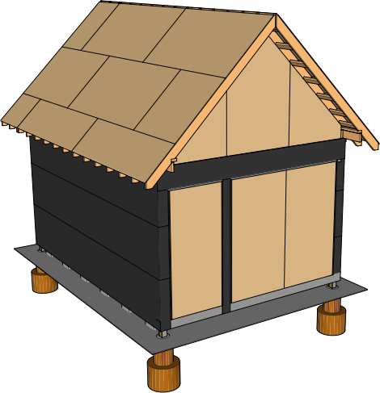

## Roof

Wait to start the roof until you have a good few days to work on it. It will be hard to cover until at least the sheathing is up. 

Now that the shed is enclosed, you can store the supplies for the roof inside. To help with organization we recommend building a simple lumber rack to accommodate the large materials. It also is helpful to precut the rafters at this stage. You can also assemble the gables in advance since they aren’t too heavy to lift up to the roof with two people.

### 01 Raised Top Plate

Install the raised top plates first in preparation for the rafters.

| Item | Amount |
|---|---|---|---|
|2x4x12 | 2
|2x4x8 | 5

### 02 Gables

Assemble the gables on a flat surface. Stand them up one at a time, squaring them to the edge. Cut a forty five degree edge onto a 2x4 and attach to the roof floor and gable to keep it from tipping until the rafters are installed..

| Item | Amount |
|---|---|---|---|
| 2x4x6 | 10
| 2x4x8 | 2

### 03 Rafter Overhangs

Precut the rafters to size using the dimensions provided. Make sure to cut notches in four of the rafters for the outriggers to sit into. This could be done by cutting multiple grooves to the depth required until it is easy to chisel out the excess. 

Assemble three of the rafters, which connect to the outriggers, with the blocking before lifting them into place. Repeat for all four corners.

#### Overhang Blocking

| Item | Amount |
|---|---|---|---|
| 2x4x1.5' | 28

6 2x4x8s

#### Outriggers

| Item | Amount |
|---|---|---|---|
| 2x4x2.5' | 28

10 2x4x8s

### 04 Ridge Beam

Next, run a line east to west to determine a straight ridge line. Install one of the ridge beams. Because of the length of the ridge beam, it is built in two pieces. Cut one of the pieces and measure out and mark where the last two rafters should sit. Install the ridge beam by placing it on a gable and nailing two additional rafters at the end in place. Make sure the ridge beam stays true to your line to keep your roof from being warped.Nail the ridge beam to the rafters that are supported by the outriggers. Repeat for other side.

For additional support nail connecting plates to the ridge beam joint. 

## 05 Rafters

Install the remaining rafters singing the provided nailing schedule. Attach hurricane ties using screws where the rafters meet the raised top plate.

| Item | Amount |
|---|---|---|---|
| 2x6x12 | 32
| 1x10x12 | 1
| 1x10x8 | 1
| Hurricane Ties | 26

| Placement | Nail Size | Frequency | Occurances | 3.5"  Nails
|---|---|---|---|---|
| Rafter to plate, toe nail | 3.5" | 2 | 32 | 64
| Rafter to ridge, toe nail | 3.5" | 4 | 32 | 128
|**Total**|||| 192

### Collar Ties

Install collar ties to help prevent the rafters from coming apart at the top. 

| Item | Amount |
|---|---|---|---|
| 1x3x7 | 3

### Roof Sheathing

Installing the roof sheathing is the most laborious part of this design. Make sure to have at least two additional people helping you. Build simple slides out of four 2x6x12’s, this will help you guild the sheathing up to the roof. Notch a square corner out of spare 2x4 to use as a pushing stick. 

Tack the slide to the rafters ends,then have one to two people life the plywood up to the 2 people on the roof. Have one person on the roof tack the plywood into place using the nail gun, once you confirm it is square to the bottom of the rafters. Finish the nailing schedule for each piece before continuing to the next.

Start with installing the bottom pieces before the top. 

Roof plywood must be at least 5/8 inches thick (IRC TABLE R803.1)

| Item | Amount |
|---|---|---|---|
|4x8 19/32" | 12

#### H-Clips

#### Stagger plywood for strength

#### Estimate

* 24' edge length for each 4x8 = 48 nails per sheet
* Two 8' center lengths for each 4x8 = 16 nails per sheet

| Placement | Nail Size | Nail Frequency / Number | Occurances | 2.5"  Nails
|---|---|---|---|---|
| Edges on Studs | 2 or 2.5" | Every 6" on center | 12 sheets | 576
| Center on Studs | 2 or 2.5" | Every 12" on center | 12 sheets | 192
|**Total**|||| 768

### Eave End Blocking

Use Scrap

### Gable Sheathing

| Item | Amount |
|---|---|---|---|
|4x8 3/8" plywood | 6

### Gable Felt

### Roof Felt

| Item | Amount |
|---|---|---|---|
|Roof Felt | 380 sq ft

### Fascia

| Item | Amount |
|---|---|---|---|
| 1x6x12 | 2
| 1x6x8 | 2
| 1x8x12 | 4

### Roofing

#### Pricing
Advantage-Lok
&#36;2.53 / linear ft

Drip Edge
&#36;23 / piece 10.5 ft

Drip edge is 10.5 feet long regardless

Ridge Vent
&#36;15.90 / each 32" wide

-----

#### Panels

Standing Seam Panels

#### Roof Ridge

Ridge Flashing

Vented Ridge Closure

Ventco Ridge Cap Anchor Clip

Pop Rivet

1" #10 Pancake Head Woodscrew

2" Pancake Head Woodscrew

Double Beaded Butyl Tape

#### Roof Eave

Plumb Eave Flashing

Standing Seam Clip

Double Beaded Butyl Tape

Sealant

1" #10 Pancake Head Woodscrew

#### Floating Rake

Square Eave Flashing

1" #10 Pancake Head Woodscrew