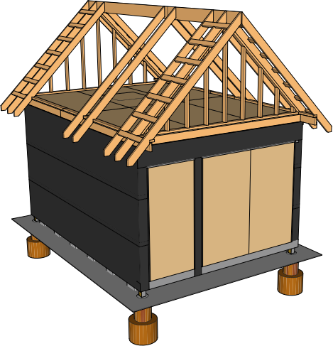

## Roof

### Raised Top Plate

| Item | Amount |
|---|---|---|---|
|2x4x12 | 2
|2x4x8 | 5

### Gables

| Item | Amount |
|---|---|---|---|
| 2x4x6 | 10
| 2x4x8 | 2

### Rafters

| Item | Amount |
|---|---|---|---|
| 2x6x12 | 32
| 1x10x12 | 1
| 1x10x8 | 1
| Hurricane Ties | 26

### Outriggers

| Item | Amount |
|---|---|---|---|
| 2x4x2.5' | 28

### Collar Ties

| Item | Amount |
|---|---|---|---|
| 1x3x7 | 3

### Overhang Blocking

| Item | Amount |
|---|---|---|---|
| 2x4x1.5' | 28

### Roof Sheathing

Roof plywood must be at least 5/8 inches thick (IRC TABLE R803.1)

| Item | Amount |
|---|---|---|---|
|4x8 19/32" | 12

#### Estimate

* 24' edge length for each 4x8 = 48 nails per sheet
* Two 8' center lengths for each 4x8 = 16 nails per sheet

| Placement | Nail Size | Nail Frequency / Number | Occurances | 2.5"  Nails
|---|---|---|---|---|
| Edges on Studs | 2 or 2.5" | Every 6" on center | 12 sheets | 576
| Center on Studs | 2 or 2.5" | Every 12" on center | 12 sheets | 192
|**Total**|||| 768

### Eave End Block

Use Scrap

### Gable Sheathing

| Item | Amount |
|---|---|---|---|
|4x8 3/8" plywood | 6

### Roof Felt

| Item | Amount |
|---|---|---|---|
|Roof Felt | 380 sq ft

### Gable Felt

### Fascia

### Roofing

#### Pricing
Advantage-Lok
&#36;2.53 / linear ft

Drip Edge
&#36;23 / piece 10 ft

Ridge Vent
&#36;15.90 / each 32" long 

### Soffit Vents

