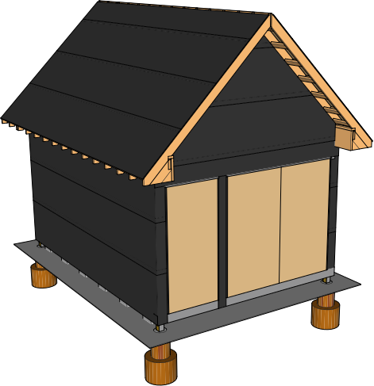
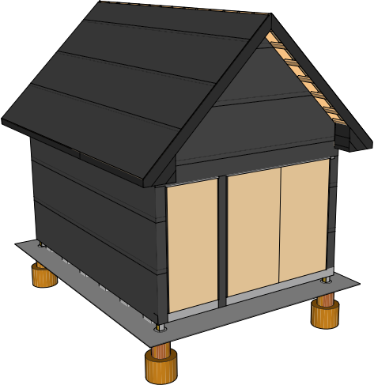
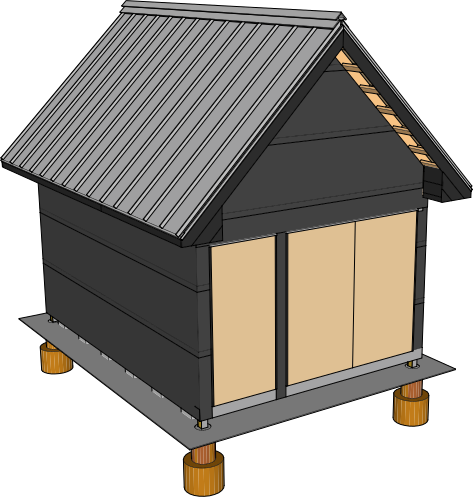

# Roof

1. [Eave End Blocking](#eaveendblocking)
* [Fascia](#fascia)
* [Roofing](#roofing)

[Supplies List](#supplies)

## 1 Eave End Blocking 

Use Scrap lumber from the rafters to build out the eave end blocking. This will give you something to attach the fascia to.  

## 2 Fascia 

Install flashing over the fascia to keep carpenter bees away

## 3 Roofing 

### Pricing
Advantage-Lok
&#36;2.53 / linear ft

Drip Edge
&#36;23 / piece 10.5 ft

Drip edge is 10.5 feet long regardless

Ridge Vent
&#36;15.90 / each 32" wide

-----

### Panels

Standing Seam Panels

### Roof Ridge

Ridge Flashing

Vented Ridge Closure

Ventco Ridge Cap Anchor Clip

Pop Rivet

1" #10 Pancake Head Woodscrew

2" Pancake Head Woodscrew

Double Beaded Butyl Tape

### Roof Eave

Plumb Eave Flashing

Standing Seam Clip

Double Beaded Butyl Tape

Sealant

1" #10 Pancake Head Woodscrew

### Floating Rake

Square Eave Flashing

1" #10 Pancake Head Woodscrew

## Supplies 

| Item | Amount | Use 
|---|---|---|---|
| 1x6x12 | 2 | Fascia
| 1x6x8 | 2 | Fascia
| 1x8x12 | 4 | Fascia