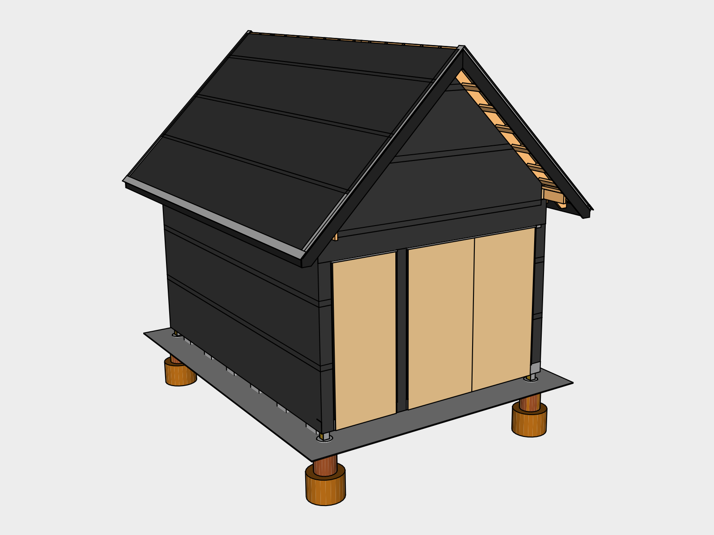

# Roof

The roofing material used is mill finish Galvalume steel, which is perfect for rainwater harvesting. Unpainted or Mill Finish avoids the use of paint.

## Use Installers Manual

This 

## 01. Fascia 

	
### Eave Fascia
Burn & oil two 1x6x8s and two 1x6x12s to use as Eave Fascia. Rather than trusting blueprints for finishing pieces, it's better to measure the actual structure to compensate for any warping that may have occurred. 

Install the boards 1.5” below where the fascia meets the sheathing. This will maintain the 45 degree pitch. Level each board as you install. Tack the boards in first using *2 1/2” galvanized finishing nails* loaded in the *Finishing Nailer*. Then use two *2 1/2” Hex Deck Screws* to attach the boards to the rafters. This will help provide additional strength to the rafters, and insures the gutters have plenty of support during rainfall.

### Cutting Tip
You can measure and precut the boards before burning & oiling them or you can cut them afterwards and use a *Butane Torch* loaded with *Butane* to touch up the exposed areas.

### Rake Fascia
To measure and cut the four 1x8x12 Boards for the Rake Fascia, first cut 45 degree angles at the end of the boards, then tack them up in place using a *16 Gauge Finishing Nailer* loaded with *1 1/4" Finishing Nails*. This will allow you then mark the bottom edge using the Eave Fascia to make sure they'll line up. Carefully pry the boards away and hammer out the finishing nails before making your cuts.

## 02. Roof Flashing

### Eave Flashing
Install

Plumb Eave Flashing

Standing Seam Clip

Double Beaded Butyl Tape

Sealant

1" #10 Pancake Head Woodscrew

### Rake Flashing

Square Eave Flashing

1" #10 Pancake Head Woodscrew

## 03. Roofing

### Pricing
Advantage-Lok
&#36;2.53 / linear ft

Drip Edge
&#36;23 / piece 10.5 ft

Drip edge is 10.5 feet long regardless

Ridge Vent
&#36;15.90 / each 32" wide

### Panels

Standing Seam Panels

## 04. Roof Ridge

Ridge Flashing

Vented Ridge Closure

Ventco Ridge Cap Anchor Clip

Pop Rivet

1" #10 Pancake Head Woodscrew

2" Pancake Head Woodscrew

Double Beaded Butyl Tape

## Tools

| Item | Amount |
|---|---|
| Butane Torch | 1
| Butane | 1
| 16 Gauge Finishing Nailer | 1
| 

## Supplies 

| Item | Amount | Use 
|---|---|---|---|
| 1x6x12 | 2 | Fascia
| 1x6x8 | 2 | Fascia
| 1x8x12 | 4 | Fascia
| 1 1/2” galvanized finishing nails
| 2 1/2” galvanized finishing nails
