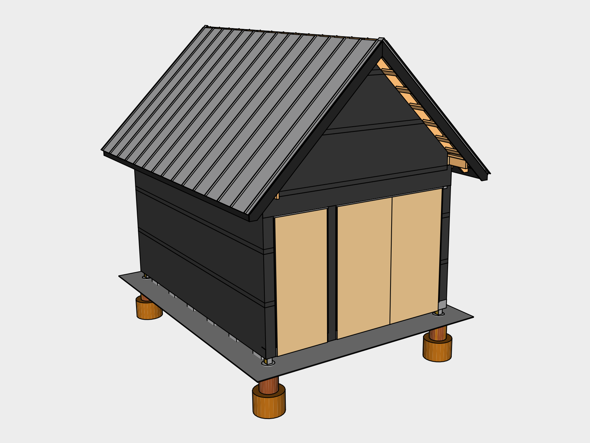
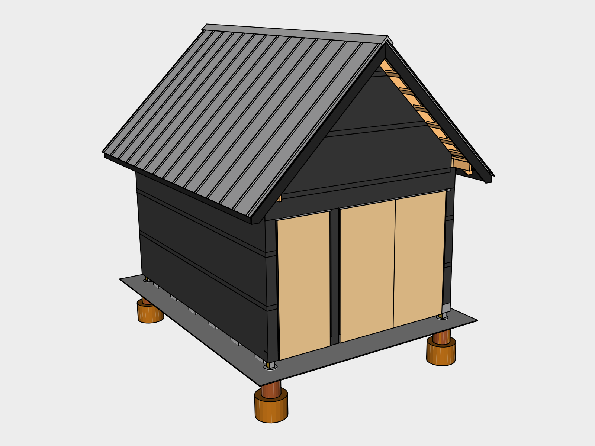

# Roofing

The roofing material used is mill finish Standing Seam Snap-Lock Galvalume steel, which is perfect for rainwater harvesting. Unpainted or Mill Finish avoids the use of paint.

## What to Order

standing seam Snap Lock Mill Finish

Plumb Rake

Square Eave

12:12 pitch

## Read the Manufacturer Instructions

This chapter covers generally what you should expect when installing snap-lock roofing. However, there are several manufacturers of this type of roofing in the US, and the instructions will vary slightly depending on who you use. Consult with the manufacturer or supplier to get the proper instructions for your installation.

## 01. Fascia 

	
### Eave Fascia
Burn & oil two 2x6x8s and two 2x6x12s to use as Eave Fascia. Rather than trusting blueprints for finishing pieces, it's better to measure the actual structure to compensate for any warping that may have occurred. 

Install the boards 1.5” below where the fascia meets the sheathing. This will maintain the 45 degree pitch. Level each board as you install. Tack the boards in first using *2 1/2” galvanized finishing nails* loaded in the *Finishing Nailer*. Then use two *2 1/2” Hex Deck Screws* to attach the boards to the rafters. This will help provide additional strength to the rafters, and insures the gutters have plenty of support during rainfall.

### Cutting & Burning Tip
You can measure and precut the boards before burning & oiling them or you can cut them afterwards and use a *Butane Torch* loaded with *Butane* to touch up the exposed areas.

### Rake Fascia
To measure and cut the four 1x8x12 Boards for the Rake Fascia, first cut 45 degree angles at the end of the boards, then tack them up in place using a *16 Gauge Finishing Nailer* loaded with *1 1/2" Finishing Nails*. This will allow you then mark the bottom edge using the Eave Fascia to make sure they'll line up. Carefully pry the boards away and hammer out the finishing nails before correcting your marks with a *Speed Square* and making your cuts.

After finishing the boards, install them with *1 1/2" Finishing Nails* where needed and two *2 1/2" Hex Deck Screws*.

## 02. Roof Drip Edge

Install the *Eave Drip Edge* lapped under the underlayment  at the eave using *1" Pancake Head Woodscrews*. Join pieces by trimming the folded sections of the edges so that one can slide into the other. Next install the *Rake Drip Edge* over the underlayment starting at the top.

### Cutting Metal
To trim metal use *Metal Snips* for detail work, and a *Shears Attachment Accessory* attached to your *Driver* for long cuts. 

## 03. Roofing

Start on the west side and work west to east. This will maximize the time you spend in the shade.

### First Panel

Measure the distance from outside of the rake drip edge to the center of the first rafter. It may be easiest to do this my measuring at the ridge. You'll want your roofing screws to be lined up close to your rafters for strength. Mark a panel of roofing the distance you measured out from the center of the screw holes plus 1 1/8" for the hem. Then draw a line using your *Plumb Chalk Line* and cut it using your *Shears Attachment Accessory*. 

#### Panel Trimming
Next measure 1 1/8" from the bottom of the panel and cut away the standing seam and lapped edge leaving the rest of the panel to be bent under the eave drip edge. When cutting the standing seam leave a small amount on one side to fold in front of the exposed gap for a cleaner look.

#### Bending
Bend the bottom edge 180 degrees by using a *16" Hemming Tool*. Next bend the trimmed side half way along the whole edge and then to 180 degrees to minimize buckling.

#### Installation
Slide the panel onto the roof with the drip edge sliding into the folds. Have one person hold the bottom using the *8 Foot Step Ladder* while another uses the *24' Extension Ladder* attached to the eave with the *Ladder Lock* and the *8' Straight Ladder* hanging over the ridge to climb to the top and screw the panel in using one of the panels manufactured holes. Screw the bottom in using the *Driver* and *1" Pancake Head Woodscrews* and work your way back up using the recommended fastener scheduling from your manufacturer.

### Repeating Panels
For the remaining panels prep them by trimming and bending the bottom edge. Then slide the standing seam along the edge of the previous panel with the end sliding under the drip edge. Use the *Rubber Mallet* to snap the seam into place at the bottom and place the first screw in at the bottom to hold the panel in place. Next snap the rest of the panel into place as you work your way towards the ridge. Once it's snapped in place screw the panel in and move on to the next one.

### Last Panel

## 04. Roof Ridge

## Existing Tools

| Item | Amount |
|---|---|
| Speed Square | 1 
| Plumb Chalk Line | 1
| 8 Foot Step Ladder | 
 
## Tools

| Item | Amount |
|---|---|---|
| Butane Torch | 1 |
| Butane | 1 |
| 16 Gauge Finishing Nailer | 1 |
| Metal Snips | |
| Shears Attachment Accessory
| 16" Roofing Bending Tool

## Supplies 

| Item | Amount | Use 
|---|---|---|---|
| 2x6x12 | 2 | Fascia
| 2x6x8 | 2 | Fascia
| 1x8x12 | 4 | Fascia
| 1 1/2” galvanized finishing nails
| 2 1/2” galvanized finishing nails

### Pricing
Advantage-Lok
&#36;2.53 / linear ft

Drip Edge
&#36;23 / piece 10.5 ft

Drip edge is 10.5 feet long regardless

Ridge Vent
&#36;15.90 / each 32" wide

Standing Seam Panels

Ridge Flashing

Vented Ridge Closure

Ventco Ridge Cap Anchor Clip

Pop Rivet

1" #10 Pancake Head Woodscrew

2" Pancake Head Woodscrew

Double Beaded Butyl Tape