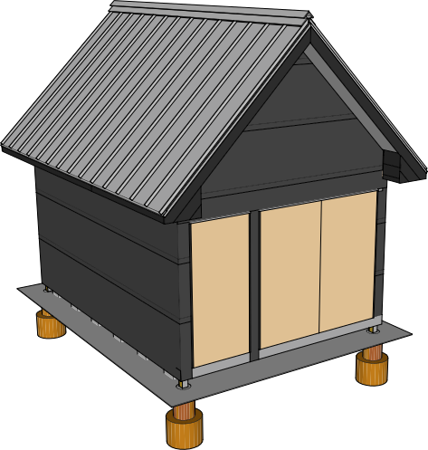

## Wall Exterior

### Insect Screen

12 4' strips on bottom

16 4' strips for top

28 4' strips total

### Furring Strips

| Item | Amount |
|---|---|---|---|
|1x2x8 Furring Strips | 50

### Siding

1x8 Siding

 16V-Joint	3/4" x 6-7/8"	Yellow Pine
Tongue & Groove
V-Joint

Sold in precut lengths:
8, 10, 12, 14, 16

&#36;2.05 / linear ft

22.5 - north/south

22 - east west

| Item | Order | Area |Amount | Cost / Piece | Price
|---|---|---|---|---|---|
| 13' lengths | 14' | north / south |  20 | &#36;25.90 | &#36;518
| 12' lengths | 12'  | north / south | 12 | 22.2 | 266.4
| 30 2.5' | 14' | east / west | 6 | 18.5 | 277
| 12' lengths | 14' | east / west | 30 | 22.2 | 666
| **Total** | ||&#36;1727.4

Steve Marsh
804 358 2103

####Shou Sugi Ban

Propane Torch

Propane

Oil (tung or other)

Bucket for oil

Rag or brush for oil

Gloves

Coarse Brush

Burn until black, ash patches means your overdone. Not a big deal, it will come off with brushing. Brush all excess off until you see the grain. Wash the dust off. Oil the wood using a rag or brush and install.

### Soffit Vents

### Ramp

| Item | Amount |
|---|---|---|---| 
| 2x12x12 treated | 2
| 4x8 19/32" exterior plywood | 2