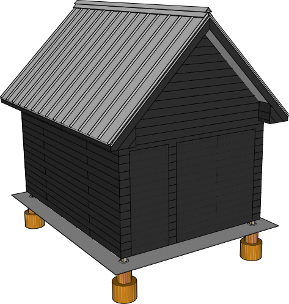

## Wall Exterior

### Insect Screen

### Furring Strips

| Item | Amount |
|---|---|---|---|
|1x2x8 Furring Strips | 50

### Siding

| Item | Amount | Cost | Price
|---|---|---|---| 
| 13' lengths | 41 | &#36;1.85 / linear ft | &#36;986.05
| 16' lengths | 30 | &#36;1.85 / linear ft | &#36;888
| **Total** | ||&#36;1,874.05

####Shou Sugi Ban

Propane Torch

Propane

Oil (tung or other)

Bucket for oil

Rag or brush for oil

Gloves

Coarse Brush

Burn until black, ash patches means your overdone. Not a big deal, it will come off with brushing. Brush all excess off until you see the grain. Wash the dust off. Oil the wood using a rag or brush and install.

### Ramp

| Item | Amount |
|---|---|---|---| 
| 2x12x12 treated | 2
| 4x8 19/32" exterior plywood | 2