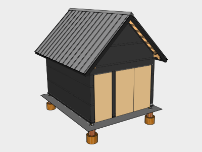
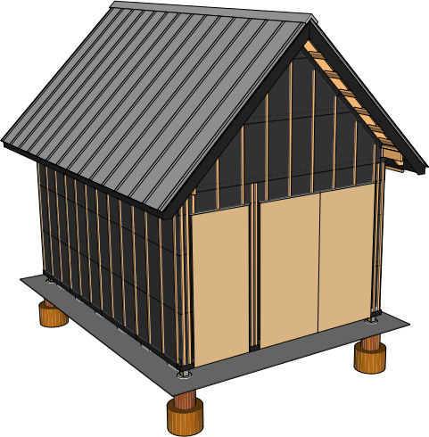
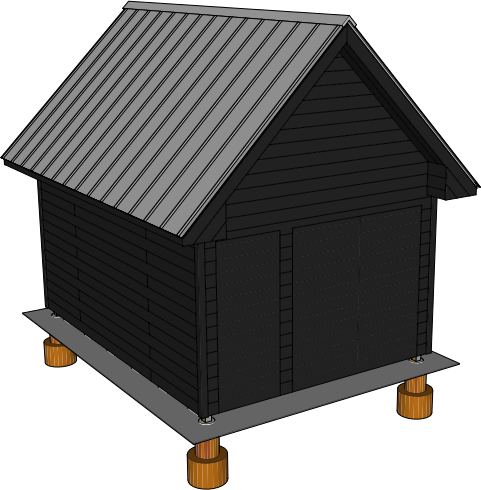
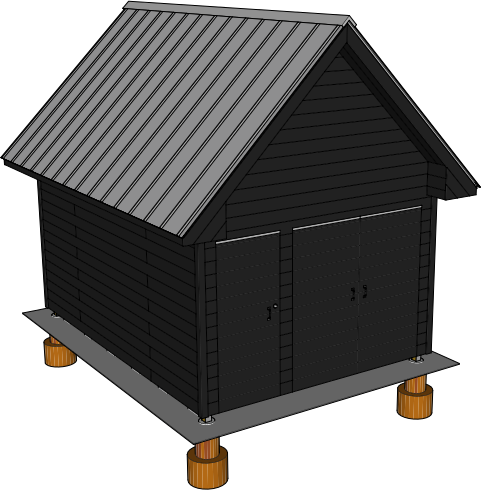
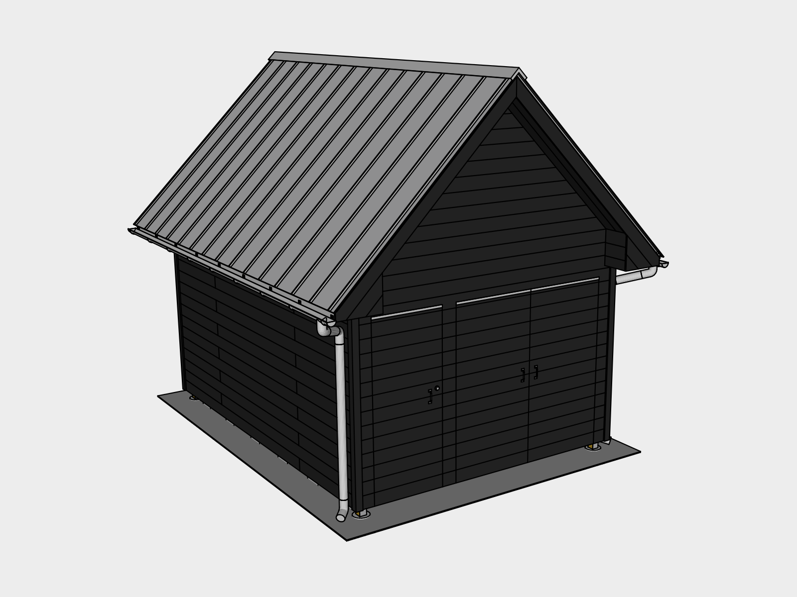

## Wall Exterior

The space between wall paper and siding is called a rain screen. It assumes that water will eventually get behind the siding due to horizontal rain, and when it does, gives the water a place to go, and enough ventilation for it to dry.

### 01. Insect Screen

An insect screen is installed at the top and bottom of the rain screen to keep insects from living behind your siding while allowing ventilation and drainage.

We used a product called *Coravent*, corrugated plastic strips with a plastic fabric mesh on one side. We’re currently looking for a plastic-free alternative. Please contact us if you’re aware of one.

Tack the strips in first using *2 1/2” Galvanized Finishing Nails* loaded in the *Finishing Nailer* as needed.

For the north & south sides, rest furring strips on the bottom vent strips to get the location/height for the top vent strips.

Cut the strips to size as needed using a *Small Hand Saw*.

## 02. Furring Strips

*1"x2"x8' Furring Strips* are attached vertically inline with the studs. Since the rafters line up with the studs, simply place the top of a strip inline with a rafter at the top and then *Level* it, resting the bottom on the insect screen. Tack in with *2 1/2” Galvanized Finishing Nails* as needed.

## 03. Eave End Blocking 

Use leftover lumber from the rafters to build out eave end blocking. This will give you something to attach the siding to. Install using the *Battery Powered Electric Nail Gun* loaded with *2.5" Interior Nails* while standing on the *8' Step Ladder*.

## 04. Siding

### Preparation
Finishing the siding using the Shou Sugi Ban method can take time. Rather than finishing it all in advance, switch between installation and finishing to break up the work, or having one person install, while the other finishes.

### Dimensions
Find *14' 16V-Joint	3/4" x 6-7/8"	Tongue & Groove Siding* at your local lumber yard. The final lengths of the siding are 12' 3/4" x 16' 6 3/4". The optimal length for this project is 14' since it's long enough to cover the east/west sides, and won't leave an awkward overlap on the north/south sides. You may need to work around these dimensions depending on what your local lumber yard carries.

### North / South
The north/south sides are the most vulnerable, so finish those first. To make sure the siding extends as far as needed out from the wall, use furring strips attached on either east/west side as your edge. 

Tack the bottom boards in first using *2 1/2” Galvanized Finishing nails* loaded in the *Finishing Nailer*. Nail the first board into each furring strip in the center of the board. Next nail the same board at a 45 degree angle into edge which joins the face and the tongue. Use this location to attach the remaining boards as it helps conceal the nails.

If you're using lengths of siding which are shorter than the side, alternate which end the joint is on for each row to help with strength and appearance.

The rest of the boards will rest on the ones below. Use a *Rubber Hammer* to make sure each board is seated before nailing it in.

#### Peak
The east / west sides are identical except for the doors. To finish the peak, you’ll want to use *Measuring Tape* to get the distance between the eave ends. Once you begin to cut your 45 degree angles for the peak, use each board to mark the cuts for the next before installing, this will keep you from having to measure each time.

### Doors
The doors may take a few days to finish and you won’t have access to inside of the shed while your working. So plan carefully.

#### Rebuild Doors
Take the doors down from their temporary hinges using your *Battery-Powered Driver*. Replace the section of 2x4 which had the deadbolt attached to it. Count the number of siding rows you'll need to finish the portion of the siding which covers the doors using the north or south wall. Pull out enough siding to finish that section and set it aside wrapped in a *Tarp* weighed down with *Bricks*. Take the sheathing off the doors and put the frame of the first door into place by hammering shims into all four sides while someone else holds the door. Next use *2 1/2” Finishing Nails* loaded in your *Battery-Powered 16 Gauge Finishing Nailer* to tack the door into place by shooting a nail at a 45 degree angle through the door and into the door frame. Nail twice towards the very top and bottom of both sides and once at the  middle top. These will be cut later once the siding is cut out and the doors are mounted. Repeat for each door.

#### Door Siding
Install the siding over the doors and mark each piece where the the door gaps are so you can confirm your cut lines later. Nail the pieces as you normally would into the furring strips. In addition, nail through into the door frame and add additional nails at the bottom near cut edges both inside and outside the cut. This is to reinforce the siding since the doors move. 

#### Mark the Door Cuts
Before covering the top edge of the doors, run a *String Line* with *String Line Levels* on it matched up with the top gaps. Mark the north & south siding where the string line is. Then after installing the next piece, use the *Plumb Bob Chalk Line* to mark a line which matches where the gap was. Also mark the vertical door gap lines by dropping the *Plumb Bob Chalk Line* and matching it up to your gap marks.

#### Saw Guide
Measure the distance between the *Circular Saw* plate edge and the blade. Tack furring strips on the siding to act as a long rip guide at the distance you measured. To confirm the distance is correct, run your blade over the siding with it off using your guide and make sure it runs along your mark. 

#### Door Hinges
Start with the edges which will have *Hinges* on them first. One they’re done, drill the holes and insert the *Bolts* through the hinges to hold the weight until you can get the *Washers* and *Nuts* tightened on.

#### Door Cutting Technique
To cut the doors, adjust your *Circular Saw* to be about an 1/8 deeper than the siding. You can do this easily by adjusting the blade while holding in on one edge of the wall to compare it to the siding depth. To cut, start the blade above the siding towards the bottom, with the top edge resting against your rip guide and the blade pulled out away from the siding. Start the saw and slowly insert the blade all the way in, then start your cut upwards. Since the blade is curved you will end up with a small amount uncut where the marks meet. Use a *Small Hand Saw* to finish the cuts.

#### Open the Small Door First
Once the small door is cut out completely, sever the nails you put in to hold the door in place using a *Mini Hacksaw*. Carefully attempt to open the door, keeping in mind the bolts are not actually attached yet. If there is resistance, you may need to confirm with your hand saw that there’s no section of siding uncut. Once the door is open, attach the nuts and washers on all the doors using a *Socket Wrench*. 

Finish your remaining cuts to open the double doors.

#### Eave End Siding

To cover the eave ends, start at the top underside of the rake and work your way down. For the first piece, cut a 45 degree lip in a small section of siding that can slide up to the 45 degree angle of the rake underside. 

45 degree cuts can be easily done by adjusting your *Circular Saw* to 45 degrees and using your *Circular Saw Rip Guide* against the siding edge to get a straight cut.

For the side under the rake fascia, start by cutting a 45 degree angle so it slides underneath.

#### Rake Underside Siding

For the rake underside, *Measure* the cut by having one person stand on the *Extension Ladder* while another stands on the *Step Ladder*. To install, pass the siding up to the person at the ridge and have the other hold it in place at the eave end. Nail it in twice at each piece of blocking. Install starting with the groove against the wall so the second piece can slide into the first.

#### Corners

Corners of a building can be the most vulnerable to rain and wind. To protect them, cut *4x4 cedar posts* 1" from the side and 2.5" deep using your *Circular Saw* and *Rip Guide*.  Do the same on another side to form a corner piece. Hold the pieces up onto the corners and mark the bottom edge to cut them to size. Burn/finish them and install them using your *Finishing Nailer* and *2.5" Finishing Nails* as needed.

#### Trim

Cut the end of a piece of *Siding* using your *Circular Saw* and *Rip Guide* to remove the tongue and create a flat edge.

Next Cut a 45 degree angle to half the depth of the siding. Then cut 3/4 inches from that edge to create a piece of trim. Repeat for all four pieces.

Install the trim on the edge between the wall siding and the rake underside to cover any gaps. Use your *Finishing Nailer* and *2.5" Finishing Nails* against the angled cut of the trim to install it.

## 05. Door Flashing & Hardware

Reinstall the *Deadbolt* using the *Doorlock installation kit*.

To protect the doors from water potentially dripping from the rain screen, install *8" Flashing* over the top and nail it into the 2x4 on top by *Hammering* in *Roofing Nails*. Cut the corners of the backside of the flashing so it doesn't catch on the door stop trim.

Install *Handles* on the inside and outside to make opening and closing the doors easier. Install the outer handles centered from a siding joint.

## 06. Eave Fascia Flashing

Thick eave fascia tends to be a favorite place for carpenters bees to nest. An easy way to protect against this is to install flashing over top. To create the flashing, find a local shop that has a *Brake* (it’s a large metal bending tool). Cut *8" Flashing* into four 10 foot sections. Mark and bend each piece at 5 1/2 inches and then 7 inches, leaving an 1 1/2 inch channel. The flashing can then slide under the eave drip edge and lap over the fascia. Attach it to the fascia using *1” Roofing Nails* just use enough to keep it in place until the gutters are installed.

## 07. Soffit Vents
Install *J-Channels* first on the inside of the fascia. To make it easier to install, you can cut flaps in the upper section and fold them up to screw them in. Using *1" Sheet Metal Screws* and the *Battery-Powered Impact Driver*, install them about 1/2”-1” above the bottom of the fascia edge. Use a level to mark the siding for the j-channel which runs along the siding. Measure up the same distance and install it using your marks. Measure the distance between the fascia and the wall and subtract 1/8” to get the size of your *Soffit Vent* cuts. Leave one side of the J-Channels loose so you can insert the vents in on that side.

## 08. Gutters

Depending on the slope of your lot, you may want to choose to drain on one side or the other. You may find it easier to drain on the western side so you don't have to keep the swing of the doors in mind during installation.

### Hanger Mounts
*Measure* the height of your hanger mount and mark the low side that amount. Next and add an inch to that amount and mark it on the high side. Gutters should have around a 1/2 inch slope for every 10 feet of gutter. Draw a *Chalk Line* between the two marks for your hanger mount guide. Measure in 2 inches from either side for your first mounts. Mark your center at 9' 6 1/2". Then mark every 2' 3 3/4" until you have all 9 marks. Install your *4" Hanger Mounts* using your *Battery Powered Impact Driver* and *1" Stainless Steel Sheet Metal Screws*.

### Gutter
Place your *20' sections of 4" Mill Finish Aluminum Gutter* on the hanger mounts and move one side so it's about 1/2" past the edge of the roof. Mark the opposite side at the same location and take it back down. Cut off the excess using the *Shears Attachment Accessory* attached to your *Battery Powered Impact Driver*.  

### Gutter Outlet
Flip the gutter over and rest your *Half round Gutter Outlet* a few inches back from the end of your gutter. If you're installing on the side with the doors, you may want to set your outlet back further to give the doors more room. Using a *Carpenters Pencil* trace the edge of the outlet. Draw a smaller circle on the inside of the trace to compensate for the outlet lip. Make a large hole in the center of the marked circle using your *Battery Powered Drill* with a *1/2" Metal Drill Bit* and cut in a spiral motion working towards the inner mark using the *Shears Attachment Accessory*. Confirm the cut by sitting the outlet inside the  hole. Attach the outlet to the gutter by drilling holes against the edge of the outlet and through the gutter using a *1/8" Metal Drill Bit*. Then insert *Pop Rivets* into the holes and pop them to secure the outlet to the gutter. 

### Install Gutter
Place the gutter onto the mounts and secure it using *Hanger Mount Clips*. Place the *End Caps* on the end and secure them using *Pop Rivets*.

### Downspout
Start by trimming a *4" 10' Gutter Downspout* to 6' 6" with the crimp on the longer section. Place a *4” 75 degrees Gutter Elbow* on the crimped end. With the elbow at the bottom, install it about 4-6" back from the corner using 2 *Gutter Downspout straps* and the *Battery Powered Driver* with *1" Stainless Steel Sheet Metal Screws*. Place one elbow on the outlet, another on the remaining section of downspout. Hold the section up next to the installed downspout to mark both the length of the downspout joining the elbows, and the length of the downspout strapped to the siding. Remove the strapped downspout, cut it to size, and re-install with the additional elbows attached.

## Tools

### New Tools

| Item | Cost |
|---|---|
| Small Hand Saw
| Mini Hacksaw
| Socket Wrench piece
| Circular Saw Rip Guide
| Brake (Rent / Use) | 0
| 1/2" Metal Drill Bit

### Existing Tools

| Item | Source |
|---|---|
| Battery-Powered 16 Gauge Finishing Nailer | Roofing
| 4' Level | Foundation
| Battery-Powered Electric Nail Gun | Foundation=
| 8' Step Ladder
| Carpenter's Pencil
| Battery-Powered Handheld Circular Saw | Foundation
| Speed Square | Foundation
| Carpenter's Pencils | Foundation
| Rubber Hammer | Roofing
| Measuring Tape | Foundation
| Battery-Powered Impact Driver | Wall Structure
| Tarp | Foundation
| Bricks | Foundation
| String Line | Foundation
| String Line Levels | Foundation
| Plumb Bob Chalk Line | Wall Structure
| Socket Wrench | Foundation
| Extension Ladder | Wall Structure
| Doorlock installation kit | Wall Structure
| Hammer | Foundation
| Shears Attachment Accessory | Roofing
| Battery Powered Drill | Foundation
| 1/8" Metal Drill Bit | Roofing

## Supplies

### New Supplies

| Item | Use | # | Cost |
|---|---|---|
| 4' Coravent Strips | Insect Screen | 28
| 1"x2"x8' Furring Strips | Rain Screen | 50
| 14' 16V-Joint	3/4" x 6-7/8"	Tongue & Groove Siding || 72  | $28.70 | $2,066.40
| Hinges
| Bolts
| Washers
| Nuts
| 4x4 cedar posts | Siding Corners
| 8 inch Flashing | Door & Eave
| Handles
| J-Channels
| Soffit vents
| 1" Sheet Metal Screws
| 4" Hanger Mounts with Spring Clips || 18
| 20' sections of 4" Mill Finish Aluminum Gutter || 2
| Half round Gutter Outlets || 2
| 4" Half Round Gutter End Caps || 4
| 4" 10' Gutter Downspouts || 2
| Gutter downspout straps || 4
| 4” 75 degrees Gutter Elbows || 6

## Existing Supplies

| Item | Amount | Use | Chapter
|---|---|---|---|
| 2 1/2” Galvanized Finishing nails | | Various | Roofing
| 2.5" Interior Nails for Nail Gun | | Eave End Blocking | Foundation
| Roofing Nails | | Door Flashing | Wall Structure
| Pop Rivets