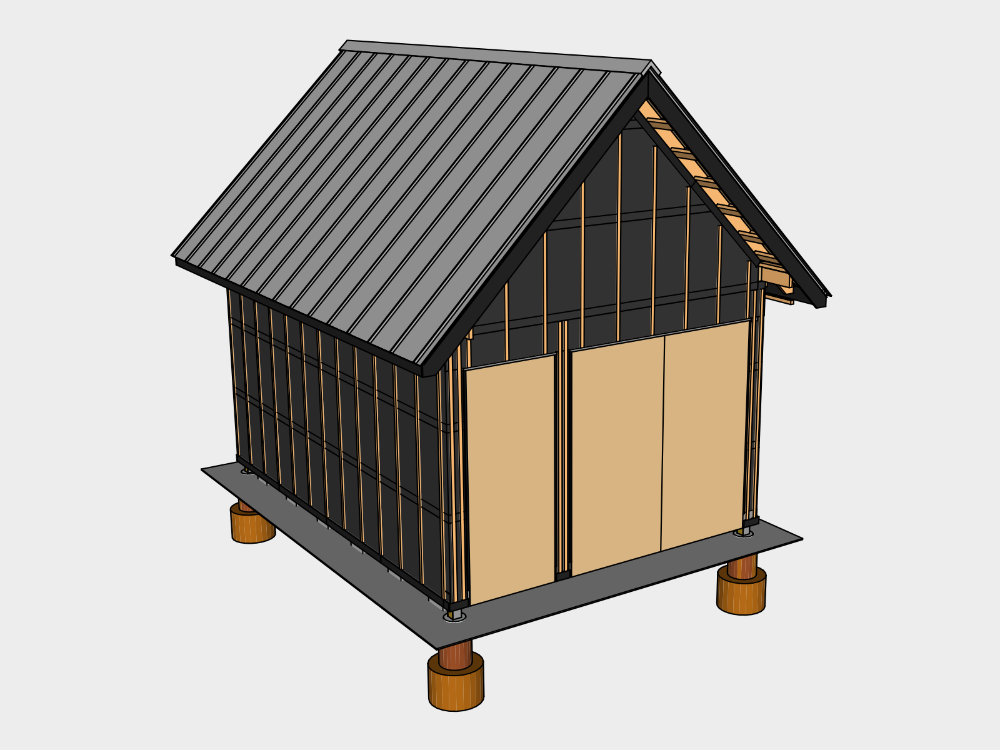
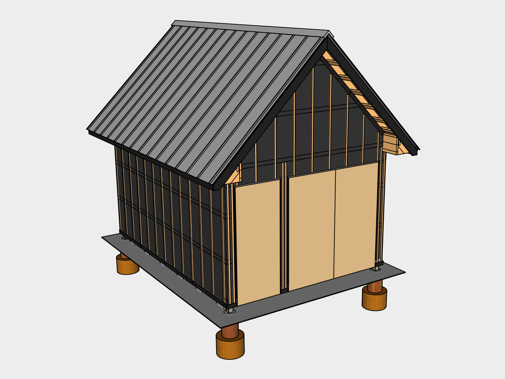

## Wall Exterior

The space between wall paper and siding is called a rain screen. It assumes that water will eventually get behind the siding due to horizontal rain, and when it does, gives the water a place to go, and enough ventilation for it to dry.

### 01. Insect Screen

An insect screen is installed at the top and bottom of the rain screen to keep insects from living behind your siding while allowing ventilation and drainage.

We used a product called *Coravent*, corrugated plastic strips with a plastic fabric mesh on one side. We’re currently looking for a plastic-free alternative. Please contact us if you’re aware of one.

Tack the strips in first using *2 1/2” Galvanized Finishing nails* loaded in the *Finishing Nailer* as needed.

For the north & south sides, rest furring strips on the bottom vent strips to get the height for the top vent strips.

## 02. Furring Strips

*1"x2"x8' Furring Strips* are attached vertically inline with the studs. Since the rafters line up with the studs, simply place the top of a strip inline with the rafter center at the top and then *Level*, resting the bottom on the insect screen. Tack in with finishing nails as needed.

## 03. Eave End Blocking 

Use leftover lumber from the rafters to build out eave end blocking. This will give you something to attach the siding to. Install using the *Battery Powered Electric Nail Gun* loaded with *2.5" Nails*.

## 04. Siding

### Preparation

### Dimensions
Find tongue and groove siding at your local lumber yard. The final dimensions of the siding are 12' 3/4" x 16' 6 3/4". The optimal length for this project is 14' since it's long enough to cover the east/west sides, and won't leave an awkward overlap on the north/south sides. You may need to work around these dimensions depending on what your local lumber yard carries.

### North / South
The north/south sides are the most vulnerable, so finish those first. To make sure the siding extends as far as needed out from the wall, use the furring strips on either side as your edge. 

Tack the bottom boards in first using *2 1/2” Galvanized Finishing nails* loaded in the *Finishing Nailer*. Nail the first board into each furring strip in the center of the board. Next nail the same board at a 45 degree angle into edge which joins the face and the tongue. Use this location to attach the remaining boards as it helps conceal the nails.

If you're using lengths of siding which are shorter than the side, alternate which end the joint is on to help with strength and appearance.

The rest of the boards will rest on the ones below. Use a *Rubber Hammer* to make sure each board is seated before nailing it in.

### East / West

## 05. Soffit Vents

## Fascia Flashing

Install flashing over the fascia to keep carpenter bees away

## Gutters

gutter slope is set between 1/4 to 1/2 inch per 10 feet of guttering.

75 degree elbows are standard

You’ll need 3 for outlets and 4 for rain barrels

## Existing Tools

| 48 Inch Level | 1

## New Tools

## Supplies

| Item | Amount | Use | Pricing
|---|---|---|---|
| 4' Coravent Strips | 28
| 1"x2"x8' Furring Strips | 50

### Siding
1x8 Siding

16V-Joint	3/4" x 6-7/8"	Yellow Pine
Tongue & Groove
V-Joint

Sold in precut lengths:
8, 10, 12, 14, 16

&#36;2.05 / linear ft

22.5 - north/south

22 - east west

| Item | Order | Area |Amount | Cost / Piece | Price
|---|---|---|---|---|---|
| 13' lengths | 14' | north / south |  20 | &#36;25.90 | &#36;518
| 12' lengths | 12'  | north / south | 12 | 22.2 | 266.4
| 30 2.5' | 14' | east / west | 6 | 18.5 | 277
| 12' lengths | 14' | east / west | 30 | 22.2 | 666
| **Total** | ||&#36;1727.4
