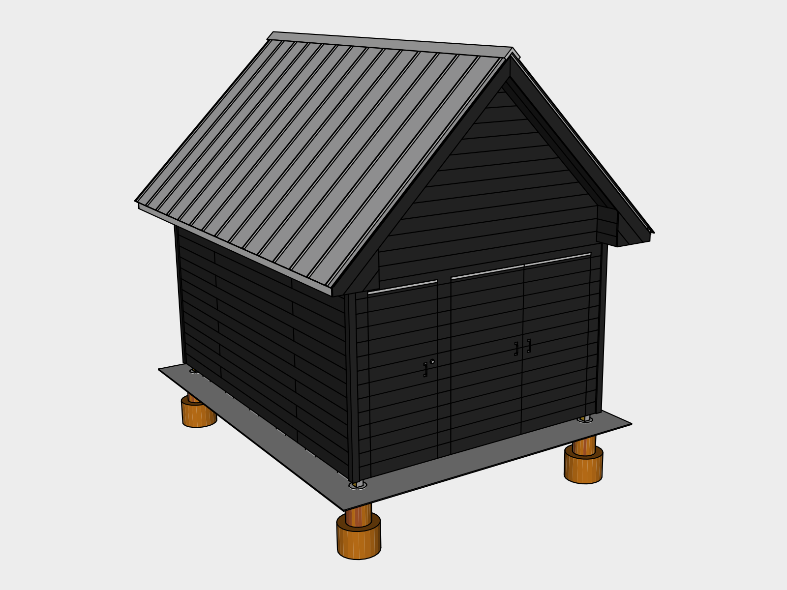

## Wall Exterior

The space between wall paper and siding is called a rain screen. It assumes that water will eventually get behind the siding due to horizontal rain, and when it does, gives the water a place to go, and enough ventilation for it to dry.

### 01. Insect Screen

An insect screen is installed at the top and bottom of the rain screen to keep insects from living behind your siding while allowing ventilation and drainage.

We used a product called *Coravent*, corrugated plastic strips with a plastic fabric mesh on one side. We’re currently looking for a plastic-free alternative. Please contact us if you’re aware of one.

Tack the strips in first using *2 1/2” Galvanized Finishing nails* loaded in the *Finishing Nailer* as needed.

For the north & south sides, rest furring strips on the bottom vent strips to get the height for the top vent strips.

## 02. Furring Strips

*1"x2"x8' Furring Strips* are attached vertically inline with the studs. Since the rafters line up with the studs, simply place the top of a strip inline with the rafter center at the top and then *Level*, resting the bottom on the insect screen. Tack in with finishing nails as needed.

## 03. Eave End Blocking 

Use leftover lumber from the rafters to build out eave end blocking. This will give you something to attach the siding to. Install using the *Battery Powered Electric Nail Gun* loaded with *2.5" Nails*.

## 04. Siding

### Preparation
Finishing the outer of the siding using the Shoe Sugi Ban method can take time. Rather than finishing it all in advance, switching between installation and finishing can help break up the work, or having one person install, while the other finishes.

### Dimensions
Find tongue and groove siding at your local lumber yard. The final dimensions of the siding are 12' 3/4" x 16' 6 3/4". The optimal length for this project is 14' since it's long enough to cover the east/west sides, and won't leave an awkward overlap on the north/south sides. You may need to work around these dimensions depending on what your local lumber yard carries.

### North / South
The north/south sides are the most vulnerable, so finish those first. To make sure the siding extends as far as needed out from the wall, use the furring strips on either side as your edge. 

Tack the bottom boards in first using *2 1/2” Galvanized Finishing nails* loaded in the *Finishing Nailer*. Nail the first board into each furring strip in the center of the board. Next nail the same board at a 45 degree angle into edge which joins the face and the tongue. Use this location to attach the remaining boards as it helps conceal the nails.

If you're using lengths of siding which are shorter than the side, alternate which end the joint is on to help with strength and appearance.

The rest of the boards will rest on the ones below. Use a *Rubber Hammer* to make sure each board is seated before nailing it in.

#### Peak
The east / west sides are identical except for the doors. To finish the peak, you’ll want to measure to get the distance between the eave ends. Once you begin to cut your 45 degree angles for the peak, use each board to mark the cuts for the next before installing, this will keep you from having to measure each time.

### Doors
The doors may take a few days to finish and you won’t have access to inside of the shed while your working. So plan carefully.

#### Rebuild Doors
Take the doors down from their temporary hinges using your *Battery Powered Driver* and set them aside. Count the number of siding levels you'll need to finish the siding which covers the door gaps using the north or south wall. Pull out enough siding to finish that section and wrap it in a *Tarp* weighed down with *Bricks*. Put the doors into place by hammering shins into all four sides while someone else holds the door. Next use *2 1/2” Finishing Nails* loaded in your *Finishing Nailer* to tack the door into place by shooting a nail at a 45 degree angle through the door and into the door frame. Nail twice towards the top and bottom of both sides and once at the top. These will be cut later once the doors are cut out and mounted.

#### Door Siding
Install the siding over the doors marking each piece where the all the door gaps are so you can confirm your cut lines later. Nail the pieces as you normally would into the furring strips. In addition, nail through into the door frame and add additional nails at the bottom near cut edges both inside and outside the cut. This is to reinforce the siding since the doors move. 

#### Mark the Door Cuts
Before covering the top edge of the doors, run a *String Line* with *String Line Levels* on it matched up with the top gaps. Marks on the north / south siding where the string line is. Then after installing the next piece, use the *Chalk Line* to mark it. Also mark the vertical door gap lines by using the *Chalk Line* as a plumb bob and matching it up to your gap marks.

#### Saw Guide
Measure the distance between the saw guide edge and the blade. Tack furring strips on the siding to act as a rip guide at the distance you measured. To confirm the distance is correct, run your blade over the siding using your guide and make sure it runs along your mark. 

#### Door Hinges
Start with the edges which will have hinges on them first. One they’re done, drill the holes for the *Hinges* and insert the *Bolts* through the hinges to hold the weight until you can get the *Washers* and *Nuts* tightened on.

#### Door Cutting Technique
To cut the doors, adjust your saw to be about an 1/8 deeper than the siding. You can do this easily by adjusting the blade while holding in on one edge of the wall. To cut, start the blade above the siding with the top edge resting against your guide and the blade out away from the siding. Start the saw and slowly insert the blade all the way and start your cut. Since the blade is curved you will end up with a small amount uncut where the marks meet. Use a small hand saw to finish the cuts.

#### Open the Small Door First
Once the small door is cut out completely, sever the nails you put in to hold the door in place using a *Mini Hacksaw*. Carefully attempt to open the door, keeping in mind the bolts are not actually attached yet. If there is resistance, you may need to confirm with your hand saw that there’s no parts uncut. Once the door is open, attach the nuts and washers on all the doors using a *Socket Wrench*. 

Next, finish your remaining cuts to open the double doors.

#### Eave End Siding

To cover the eave ends, start at the top underside of the rake and work your way down. For the first piece, cut a 45 degree lip in a small section of siding that can slide up to the 45 degree angle of the rake underside. 

45 degree cuts can be easily done by adjusting your *Circular Saw* to 45 degrees and using your *Rip Guide* against the siding edge to get a straight cut.

For the side under the rake fascia, start by cutting a 45 degree angle so it slides under the rake fascia.

#### Rake Underside Siding

For the rake underside, *Measure* the cut by having one person stand on the *Extension Ladder* while another stands on the *Step Ladder*. To install, pass the siding up to the person at the ridge and have the other hold it in place at the eave end. Nail it in twice at each piece of blocking. Install  with the grove against the wall so the second piece can slide into the first.

#### Corners

#### Trim

## 05. Door Flashing & Hardware

## 06. Eave Fascia Flashing

Eave fascia tends to be a favorite place for carpenters bees to nest. An easy way to protect against this is to install flashing over top. To create the flashing, find a local shop that has a brake. It’s a large metal bending tool. Purchase a roll of *8 inch roll of flashing* and cut four 10 foot sections. Mark and bend each piece at 5 1/2 inches and then 7 inches. The flashing can then slide under the eave drip edge and lap over the fascia. Attach it to the fascia using *1” Roofing Nails* just use enough to keep it in place until the gutters are installed.

## 07. Soffit Vents
Install J-Channels first on the inside of the fascia. To make it easier to install, you can cut flaps in the upper section and fold them up to screw them in. Install them about 1/2”-1” above the bottom of the fascia edge. Use a level to mark the siding for the j-channel which runs along the siding. Measure up the same distance and install it using your marks. Measure the distance between the fascia and the wall and subtract 1/8” to get the size of your soffit vent cuts.

## 08. Gutters

4 Inch Half Round Aluminum gutters

Gutter slope is set between 1/4 to 1/2 inch per 10 feet of gutter. 75 degree elbows are standard

24" on center spacing

You’ll need 3 for outlets and 4 elbows for rain barrels.

## Existing Tools

| 48 Inch Level | 1

## New Tools

## Supplies

| Item | Amount | Use | Pricing
|---|---|---|---|
| 4' Coravent Strips | 28
| 1"x2"x8' Furring Strips | 50

### Siding
1x8 Siding

16V-Joint	3/4" x 6-7/8"	Yellow Pine
Tongue & Groove
V-Joint

Sold in precut lengths:
8, 10, 12, 14, 16

&#36;2.05 / linear ft

22.5 - north/south

22 - east west

| Item | Order | Area |Amount | Cost / Piece | Price
|---|---|---|---|---|---|
| 13' lengths | 14' | north / south |  20 | &#36;25.90 | &#36;518
| 12' lengths | 12'  | north / south | 12 | 22.2 | 266.4
| 30 2.5' | 14' | east / west | 6 | 18.5 | 277
| 12' lengths | 14' | east / west | 30 | 22.2 | 666
| **Total** | ||&#36;1727.4
