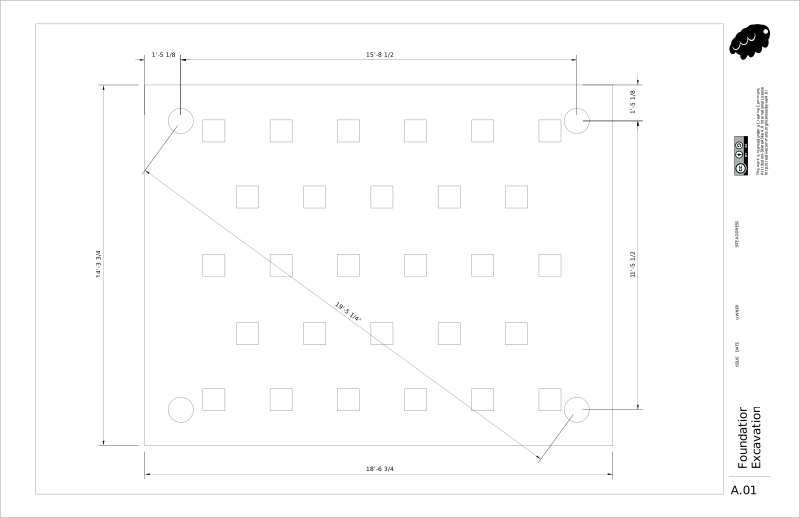
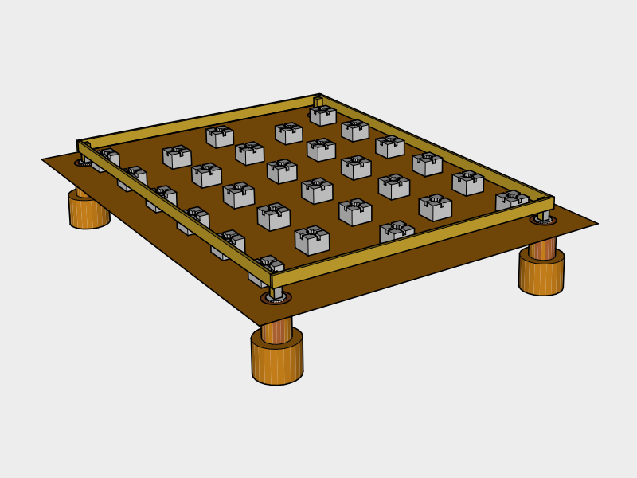
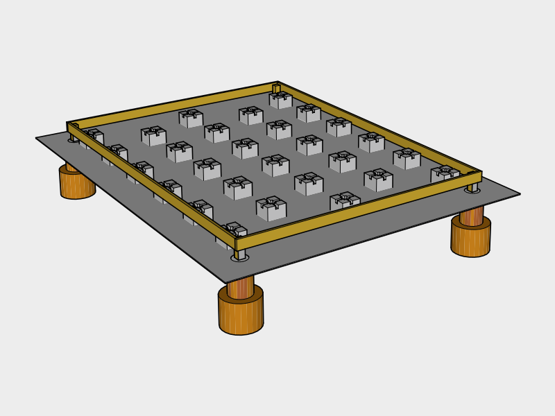
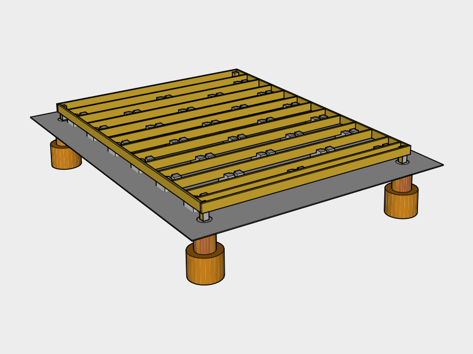
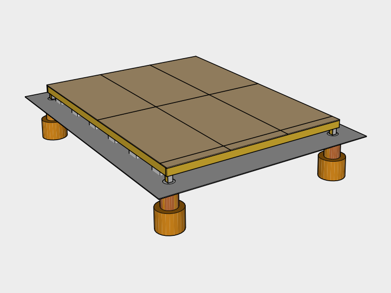

# Foundation

Pier and Block foundation was chosen for the shed since it's an uninsulated structure which needs to work in a variety of climates. Piers prevent the structure from lifting out during heavy winds, while the blocks carry the load. The depth of the piers is vary based on the frost depth location the shed will be built in, which may increase the budget.

## Survey

### Zoning Setbacks

Check your local zoning regulations for `Setback Requirements`. Find the minimum distance from your property line and other structures before deciding on a location.

### Find Level Location

To avoid major excavation, find a location which is fairly level. You can do this easily by using a _String Line_ tied between two stakes with a _String Line Level_ attached to the string to gauge slope.

### Solar South

Solar south will vary based on your location. _Sun Surveyor_ is a great app for smart phones that can help you determine where solar south is and how much shade a location will get on winter solstice. The shed is designed so the side to the left of the doors faces south. This is so one side of the roof can be used for solar, and the other for rainwater collection.

## 1. Excavation

### Mark Pier Locations

Use _Marking Chalk Spray Paint_ and a _Tape Measure_ to roughly mark the locations of the piers. Press _Stakes_ into marked corners, then measure from corner to corner and adjust the stakes until all the measurements are correct. When you're finished, pound the stakes several inches in with a _Hammer_ to keep them from moving.

Use the _String Line_ to connect the stakes to make a rectangle. Measure out 12 inches from the string and mark several points then use the marking spray paint to connect the points to create a box.

 [A01.pdf](https://github.com/dangnelson/WATERBEAR-Shed/tree/e418dea8a199a2ec08fc43dfb7ca2a76aa1c2d70/01%20Foundation/blueprints/A01.pdf)

### Remove Grass & Debris

Carefully choose a location for a soil pile and sod pile that's at least 9 feet out of the way \(you'll need that space for ladders to do roofing later\).

Use the _Shovel\(s\)_ and _Wheel Barrow_ to remove any grass, shrubs or debris from the top layer of the marked out box.

### Level Ground

Attach _String Line Levels_ to the strings on all four sides. Level starting roughly an inch above the ground at the highest point. Use this as a guide to remove top soil until the ground is leveled. Tamp the soil with a _Tamper_.

### Retaining Wall \(avoid\)

We built on an incline, and ended up with a soil ledge on one side, and had to build a retaining wall to avoid erosion. We also dug a trench for a french drain is on the inside of the retaining wall and filled it with crushed stone. This increased our build time, and building on an incline is not recommended for that reason.

### Dig Pier Holes

Rent an 8-12" _Auger_ and use the _Digging Bar_ and _Small Post Hole Digger_ if you have rocky soil.

Dig out the bottom of the hole so it flares to create a footing. This helps resist frost heave and lift from strong winds.

The depth will need to change based on the region you build in. Correct the frost depth based on your local code.

### Gravel

Add about an inch of _All Purpose Gravel_ to the bottom of every hole.

## 2. Piers

### Rebar

In retrospect we should have added rebar into the footings for additional strength. This will be fixed in a future version.

### Pour Piers

Cut the _Concrete Tube Forms_ to size using a _Hand Saw_.

Attach _3.5 Exterior Nails_ to the sides of the _Cardboard Concrete Form Tubes_ to the center of a _2x4_ cut to 2 feet. The tube should hang about 12 inches up from the bottom of the footing.

Make sure to wear a _N95 Dust Mask_ to avoid breathing in concrete dust, and _Cleaning Gloves_ to protect your skin for this next step.

Slowly pour _Water_ over 1 _Bag of Concrete_ in the _Wheel Barrow_. Mix the contents using the _Garden Hoe_ and add water gradually until you have a thick consistency.

Shovel the concrete into the forms and occasionally insert the _Margin Trowel_ into the concrete to remove any air pockets.

Once full, smooth out the top of the form with the _Margin Trowel_. Then insert a _Galvanized Post Base_ into the form, squaring it up with the other corners, centering it with where the post should be.

## 3. Fill

Wait a day and remove the _Cardboard Concrete Form Tubes_ from around the piers. Backfill with _Compactable Fill_ and tamp using the _Digging Bar_.

### Cutting Lumber

To safely cut lumber, create 2 sawhorses using 45 _2x4x8s_ cut into eight 3 foot sections and inserted into 4 _Sawhorse Brackets_. Always wear _Work Gloves_ and _Safety Glasses_ when using electrically powered equipment.

### Cut & Insert Piers

Mark the _Treated 4x4x8s_ to size using a _Carpenter's Pencil_ and _Square_ then cut using a _Battery Powered Hand-held Circular Saw_ and insert them into the _Galvanized Post Bases_. Drill the bolt holes out using a _Battery Powered Drill_ and a _1/2" diameter 6" long brad point bit_. Insert the _1/2" x 6" Galvanized Carriage Bolts_ and tighten the _1/2" Galvanized Washers_ and _1/2" Galvanized Nuts_ with a _1/2" Socket Wrench_.

### Treated wood

Treated wood can’t be composted or burned because of its toxicity and must be thrown away.

We’re open to alternatives to improve this design.

## 4. Joist End Plates

Place 2 _Treated 2x6x12s_ and 2 _Treated 2x6x16s_ as end plates on _Concrete Deck Blocks_ and use _Shims_ and a _4' Level_ to level them until they all line up with each other at the corners.

Drill the holes for the bolts and bolt the 4x4s to the end plates like you did the piers.

## 5. Deck Blocks

Mark the longer end plates for the floor joists.

Cut the remaining _2x6x12s_ to 11' 9" to use as floor joists.

Roughly place the _Concrete Blocks_ in place by inserting the floor joists into them, and aligning the joists roughly with the marks.

After each board is lined up, remove an inch of soil under each block and add _All Purpose Gravel_ under each block until the joists are level with the side beams.

Carefully mark the unattached floor joists with numbers using a _Carpenter's Pencil_ so you can place them back in the same place later. Then remove them for the next step.

## 6. Gravel

Use the _Shovel_ and the _Hoe_ to spread a layer of _\#57 Drainage Gravel_ around the blocks to improve drainage.

## 7. Floor Joists

Insert the floor joists back into place using your marks.

### Joist Connections `IRC Table 602.3(1)`

Hammer 2 _3.5" Exterior Nails_ into each end of each joist.

| Placement | Technique | Nail Size | Nail Frequency / Number | Occurances | 3.5" Nails |
| :--- | :--- | :--- | :--- | :--- | :--- |
| End Plate | End Nail | 3.5" | 2 nails | 26 | 60 |

## 8. Flooring Sheathing

Load the _Battery Powered Nail Gun_ with _2.5" Interior Nails_.

Lay _5/8" \(19/32\) Plywood_ down on top of the joists end to end, nailing the corners as you go. `IRC TABLE R503.1`

Plywood should be run so the direction of the grain runs perpendicular to the joists to increase strength.

Once in place Mark a _Chalk Line_ across the plywood for each joist using the nails on either end as a guide for nailing.

### Plywood Connection `IRC TABLE R602.3(1)`

Nail the plywood in using the following nailing schedule:

| Placement | Nail Size | Nail Frequency / Number | Occurances | Nails / Sheet | 2.5"  Nails |
| :--- | :--- | :--- | :--- | :--- | :--- |
| Edges on Studs | 2 or 2.5" | Every 6" on center | 6 sheets | 48 | 288 |
| Center on Studs | 2 or 2.5" | Every 12" on center | 6 sheets | 16 | 96 |
| **Total** |  |  |  |  | 384 |

## Cover until next step

Place _Bricks_ on _Tarp_

## Tools

### New Tools

| Item | Cost |
| :--- | :--- |
| 100' String Line | 2.98 |
| 4 [String Line Levels](https://en.wikipedia.org/wiki/Spirit_level#Line_level) | 5.86 |
| Solar Surveyor App | 10 |
| Marking Spray Paint | 5.27 |
| 25'+ [Tape Measure](https://en.wikipedia.org/wiki/Tape_measure) | 9.88 |
| 4 2-ft Wooden [Stakes](https://en.wikipedia.org/wiki/Survey_stakes) | 4.97 |
| [Hammer](https://en.wikipedia.org/wiki/Hammer) | 4.98 |
| [Digging Shovel](https://en.wikipedia.org/wiki/Shovel) | 5.98 |
| [Wheel Barrow](https://en.wikipedia.org/wiki/Wheelbarrow) | 49.97 |
| [Tamper](https://en.wikipedia.org/wiki/Tamp) | 26.98 |
| 8" \[Auger\]\([https://en.wikipedia.org/wiki/Auger\_\(drill](https://en.wikipedia.org/wiki/Auger_%28drill)\)\) Rental | 50.00 |
| [Digging Bar](https://en.wikipedia.org/wiki/Digging_bar) | 31.97 |
| [Small Post Hole Digger](https://en.wikipedia.org/wiki/Post_hole_digger) | 24.97 |
| [Hand Saw](https://en.wikipedia.org/wiki/Hand_saw) | 9.94 |
| 2 [N95 Dust Mask](https://en.wikipedia.org/wiki/Dust_mask)s | 7.47 |
| Cleaning Gloves | 1.98 |
| \[Hoe\]\([https://en.wikipedia.org/wiki/Hoe\_\(tool](https://en.wikipedia.org/wiki/Hoe_%28tool)\)\) | 15.97 |
| [Margin Trowel](https://en.wikipedia.org/wiki/Trowel) | 5.77 |
| Carpenter's Pencil Set | 3.49 |
| Speed Square | 7.67 |
| 2 Sawhorse Brackets Sets | 13.94 |
| Work Gloves | 9.99 |
| Safety Glasses | 12.99 |
| Battery Powered 7-1/4-in [Hand-held Circular Saw](https://en.wikipedia.org/wiki/Circular_saw) | 279.00 |
| Battery Powered Drill | 159.00 |
| 1/2" diameter 6" long brad point bit | 9.97 |
| 1/4" Drive SAE Socket Wrench Set | 29.97 |
| 4' Level | 14.97 |
| Battery Powered [Nail Gun](https://en.wikipedia.org/wiki/Nail_gun) | 399.00 |
| [Plumb Chalk Line](https://en.wikipedia.org/wiki/Chalk_line) | 5.97 |
| **Total** | **1,220.90** |

## Supplies

### New Supplies

| Item | Use | \# | Cost | Total |
| :--- | :--- | :--- | :--- | :--- |
| All Purpose Gravel 50 lb Bag | Piers, Blocks | 6 | 4.70 | 28.2 |
| 1/2" x 2' Rebar \(varies\) | Piers | 4 | 2.47 | 19.46 |
| 1 lb pack of 3.5" Exterior Nails | Joists | 2 | 4.27 | 9.94 |
| 8"x4' Concrete Tube Forms \(varies\) | Piers | 2 | 9.50 | 19.00 |
| 2x4x8 | Piers | 1 |  | 3.13 |
| 5-Gallon Water Jugs |  | 3 | 19.99 | 59.97 |
| Concrete 80 lb bags \(varies \) | Piers | 8 | 5.97 | 47.76 |
| 4" x 4" Galvanized Post Base | Piers | 4 | 11.37 | 45.48 |
| Cubic Yards of Compactable Fill | Piers | .25 |  | 9.42 |
| Treated 4x4x8 | Piers | 1 |  | 8.32 |
| 1/2" x 6" Galvanized Carriage Bolts | Piers, Joists | 16 | 2.53 | 40.48 |
| 1/2" Galvanized Washers | Piers, Joists | 16 | 0.24 | 5.28 |
| 1/2" Galvanized Nuts | Piers, Joists | 16 | 0.38 | 6.08 |
| Treated 2x6x12 | Joists | 14 | 9.45 | 124.32 |
| Treated 2x6x16 | Joists | 2 | 12.42 | 23.14 |
| Concrete Deck Blocks |  | 28 | 9.60 | 193.20 |
| Pack of Shims | Deck Blocks | 1 |  | 4.95 |
| Cubic Yard of \#57 Drainage Gravel | Drainage | 1 |  | 29.00 |
| 2.5" Interior Nails for your Nail Gun | Sheathing | 384 |  |  |
|  | **Total in Pack** | 2000 |  | 38.7 |
|  | Remaining | 1616 |  |  |
| 4x8 5/8" \(19/32\) Plywood | Sheathing | 7 | 19.57 | 136.99 |
| Bricks | Cover | 12 | .69 | 8.28 |
| 20' x 30' Heavy Duty Tarp | Cover | 1 |  | 89.98 |
| **Total** |  |  |  | **951.08** |

Materials noted as "\(varies\)" depends on the frost depth for your location.

