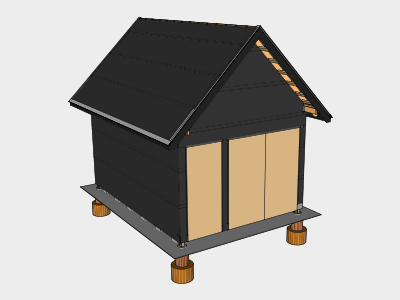
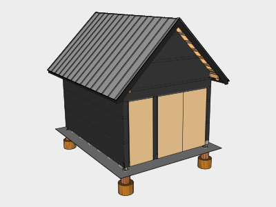
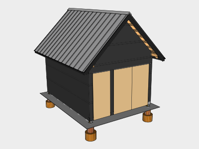

# Roofing

Look for 24-Gauge, 16" Width, Standing Seam, Snap Lock, Striated, Galvalume Coated, Steel Roofing with Unpainted Mill Finish. This type of roofing is perfect for rainwater harvesting and ordering it with a "mill finish" avoids the use of paint.

### Dimensions

A good supplier will order what you need for the roof based on the dimensions and pitch. The roofing coverage area is 2 sections which are both 10' 6" tall by 19' 1/2" wide. The pitch of the roof is 12:12.

### Read the Manufacturer Instructions

This chapter covers generally what you should expect when installing snap-lock roofing. However, there are several manufacturers of this type of roofing in the US, and the instructions will vary slightly depending on who you use. Consult with the manufacturer or supplier to get the proper instructions for your installation.

## 01. Fascia

### Eave Fascia

Burn & oil two _2x6x8s_ and two _2x6x12s_ to use as Eave Fascia. Rather than trusting blueprints for your cuts, it's better to measure the actual structure using a _Tape Measure_ to compensate for any warping that may have occurred during construction.

Standing on the _8' Step ladder_ install the boards 1.5” below where the fascia meets the sheathing. This will maintain the 45 degree pitch and insure the roofing extends past the fascia. _Level_ each board as you install them. Tack the boards in first using _2 1/2” Galvanized Finishing nails_ loaded in the _Battery-Powered 16 Gauge Finishing Nailer_. Then use two _2 1/2” Hex Deck Screws_ to attach the boards to each rafter using your _Battery-Powered Impact Driver_. This will help provide additional strength to the rafters, and insures the gutters have plenty of support during rainfall.

### Rake Fascia

To measure and cut the four _1x8x12_ Boards for the Rake Fascia, first cut 45 degree angles at the end of the boards, then tack them up in place using the _Battery-Powered 16 Gauge Finishing Nailer_ loaded with _1 1/2" Galvanized Finishing Nails_. This will allow you then mark the bottom edge using the Eave Fascia to make sure they'll line up. Carefully pry the boards away and hammer out the finishing nails before correcting your marks with a _Speed Square_ and making your cuts. After finishing the boards, install them with _1 1/2" Finishing Nails_ where needed and two _2 1/2" Hex Deck Screws_.

## 02. Drip Edge

### Cutting Metal

To trim metal use _Metal Snips_ for detail work, and a _Shears Attachment Accessory_ attached to your _Battery-Powered Impact Driver_ for long cuts.

### Eave Drip Edge

Install the _Plumb Eave Drip Edge_ lapped under the underlayment at the eaves using _1" Pancake Head Woodscrews_. Join pieces by trimming the folded sections of the edges so that one can slide into the other. If the drip edge is difficult to screw through, pre-drill holes as often as required in the manufacturer instructions. Use _1/8" Pop Rivets_ inserted in to a _Pop Rivet Gun_ to join any seams so that they become flush. Pre-drill the holes for the rivets using a _1/8" Drill Bit_

### Rake Drip Edge

Next install the _Square Rake Drip Edge_ over the underlayment starting at the top. Cut the top edge at a 45 degree angle leaving the first side with some excess on the face which is flush with the fascia. This will allow the second side to sit overtop and give a cleaner look at the joint.

Have one person hold the bottom using the _8' Step Ladder_ while another uses the _24' Extension Ladder_ attached to the eave with the _Ladder Lock_ and the _8' Straight Ladder_ hanging over the ridge with the _Ladder Hooks with Wheels_ to climb to the top and screw the drip edge to the sheathing.

For additional pieces, trim the folded sections and slide the lower piece into the upper piece.

## 03. Roofing Panels

Start on the west side and work west to east to install the _10' 6" x 16" Standing Seam Panels_. This will maximize the time you spend in the shade in the morning and evening hours.

### First Panel

Measure the distance from outside of the rake drip edge to the center of the first rafter. It may be easiest to do this my measuring at the ridge where the rafters are exposed. You'll want your roofing screws to be lined up close to your rafters for strength. Mark a panel of roofing the distance you measured out from the center of the screw holes plus 1 1/8" for the hem. Then draw a line using your _Plumb Chalk Line_ and cut it using your _Shears Attachment Accessory_.

#### Panel Trimming

Next measure 1 1/8" from the bottom of the panel and cut away the standing seam and lapped edge leaving the rest of the panel to be bent under the eave drip edge. When cutting the standing seam leave a small amount on one side to fold in front of the exposed seam gap for a cleaner look.

#### Bending

Bend the bottom edge 180 degrees by using a _16" Hemming Tool_. Next bend the trimmed side half way along the whole edge to minimize buckling and then to 180 degrees.

#### Installation

Slide the panel onto the roof with the drip edge sliding into the folds. Have one person hold the bottom using the _8 Foot Step Ladder_ while another uses the _24' Extension Ladder_ attached to the eave with the _Ladder Lock_ and the _8' Straight Ladder_ hanging over the ridge to climb to the top and screw the panel in using one of the panels manufactured holes. Screw the bottom in using the _Battery-Powered Impact Driver_ and _1" Pancake Head Woodscrews_ and work your way back up using the recommended fastener scheduling from your manufacturer.

### Repeating Panels

For the remaining panels prep them by trimming and bending the bottom edge. Then slide the standing seam along the edge of the previous panel with the end sliding under the drip edge. Use the _Rubber Mallet_ to snap the seam into place at the bottom and place the first screw in at the bottom to hold the panel in place. Next snap the rest of the panel into place as you work your way towards the ridge. Once it's snapped in place screw the panel in and move on to the next one.

### Last Panel

For the last panel, snap the bottom on and rest the seam on the lock edge so you can draw a line using the drip edge on the panel as your guide. Take the panel down and measure 1 1/8" out from the line and mark it with your chalk line. Cut and bend the edge before sliding and snapping it into place. Close the bends as desired using a _3" Hand Seamer_. Repeat these steps for the other side of the roof.

## 04. Vented Ridge Cap

### Angle Guide

To insure the bottom pieces are at the right angle, make a guide out of two 2x4s by screwing them together at their ends to make a 45 degree angle V and cut it so the inside of the guide matches the size of the ridge cap. This will allow you to place the guide on the top of the standing seams on the ridge and mark the angle needed every few seams.

### Ventilation

You made need a _Caulking Gun_ with _Sealant_ and _Double Beaded Butyl Tape_ depending on manufacturer instructions.

### Cap

Install the inner roof cap at the marked angles one side at a time per manufacturer instructions. You'll need longer _2" Pancake Head Woodscrews_ to reach the roof. The design of the ridge caps varies greatly by which manufacture you use, so follow the instructions you're given.

For the outer roof cap, slide it onto the inner cap from either side after prepping one side to slide into the other. Use pop rivets at seams to close the gap.

## 05. Snow Guards

Install _Snow Guards_ on every other seam, starting at 2 feet from the Eave. and then every 2 feet until you have 3 rows. Alternate the rows so there aren't seams without guards on them.

## Tools

### New Tools

| Item | Cost |
| :--- | :--- |
| Battery Powered 16 Gauge Finishing Nailer | 327.95 |
| Metal Snips | 16.97 |
| Shears Attachment Accessory | 59.98 |
| Pop Rivet Gun | 19.98 |
| 1/8" Drill Bit | 2.97 |
| 16" Hemming Tool | 49.50 |
| Rubber Mallet | 4.97 |
| 3" Metal Hand Seamer | 29.97 |
| Caulking Gun | 2.58 |
| **Total** | **514.87** |

### Existing Tools

| Item | Source |
| :--- | :--- |
| 20 lb Propane Tank | Wall Structure |
| Large Propane Torch | Wall Structure |
| Butane Torch | Wall Structure |
| Handheld Weed Sprayer | Wall Structure |
| Battery Powered Handheld Circular Saw | Foundation |
| Speed Square | Foundation |
| Carpenter's Pencils | Foundation |
| Tape Measure | Foundation |
| 8' Step Ladder | Wall Structure |
| 4' Level | Foundation |
| Battery-Powered Impact Driver | Wall Structure |
| 8' Step Ladder | Wall Structure |
| 24' Extension Ladder | Wall Structure |
| Ladder Lock | Roof Structure |
| 8' Straight Ladder | Roof Structure |
| Ladder Hooks with Wheel | Roof Structure |
| Plumb Chalk Line | Foundation |

## Supplies

### New Supplies

| Item | Use | \# | Cost | Total |
| :--- | :--- | :--- | :--- | :--- |
| 2x6x8 | Eave Fascia | 2 | 5.84 | 11.68 |
| 2x6x12 | Eave Fascia | 2 | 8.73 | 17.46 |
| 2 1/2” Galvanized finishing nails, 2500 Pack | Eave Fascia | 1 |  | 24.16 |
| 3 1/2” Hex Deck Screws, 1lb pack | Eave Fascia | 2 | 8.90 | 17.80 |
| 1x8x12 | Rake Fascia | 4 | 19.82 | 79.28 |
| Quart of Tung Oil | Fascia | 2 | 19.87 | 39.74 |
| 1 1/2” Galvanized finishing nails, 2500 Pack | Rake Fascia | 1 |  | 19.90 |
| 10' 6" Plumb Eave Drip Edge Section | Drip Edge | 4 | 22.04 | 88.16 |
| 1" \#10 Pancake Head Woodscrews, 250 Pack | Drip Edge, Roof Panels | 1 |  | 11.80 |
| 1/8" Pop Rivets, 100 Pack |  | 1 |  | 8.65 |
| 10' 6" Square Rake Drip Edge Section | Drip Edge | 5 | 22.04 | 110.20 |
| 10' 6" x 16" Standing Seam Panels | Roofing | 30 | 26.56 | 796.80 |
| 10' 6" Ridge Cap Section | Ridge Cap | 2 | 32.25 | 64.50 |
| 10' 6" Ridge Retainer Section | Ridge Cap | 2 | 30.02 | 60.04 |
| 32" Vented Closures | Ridge Cap | 15 | 10.80 | 162.00 |
| Double Beaded Butyl Tape | Ridge Cap | 1 |  | 9.06 |
| Sealant | Ridge Cap | 1 |  | 5.95 |
| 2 1/2" Pancake Head Woodscrews, 250 Pack | Ridge Cap | 1 |  | 25.34 |
| Standing Seam Snow Guards | Roofing | 46 | 14.03 | 645.68 |
| **Total** |  |  |  | **2,198.20** |

### Existing Supplies

| Item | Use | Source |
| :--- | :--- | :--- |
| Tung Oil | Fascia | Wall Structure |
| Rags | Fascia | Wall Structure |
| Butane Canister | Fascia | Wall Structure |

