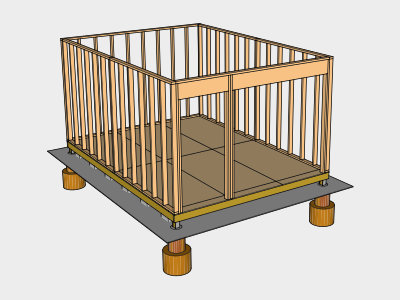
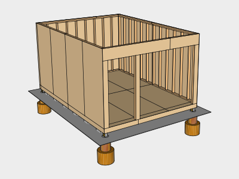
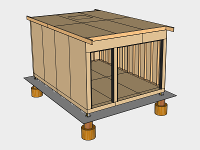
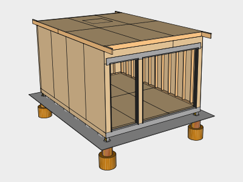
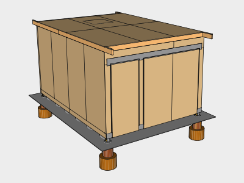
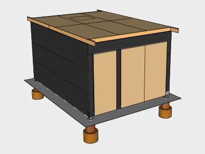

# Wall Structure

## 1. Framing

### Build Walls

Build the west back wall \(Blueprint B.01A\) first using the shed floor as a surface. Cut _2x4x8s_ to size using a _Battery Powered Handheld Circular Saw_. Mark the top and bottom _2x4x12_ plates using a _Carpenter's Pencil_ and _Measuring Tape_ and nail them together using a _Battery Powered Nail Gun_. Use a _Hammer_ to finish driving any nails that stick out. Stand up the wall and nail spare _2x4s_ at about a 45 degree angle on either side to the end of the floor joists while leveling using a _4' Level_.

Next stand up the north/south walls \(Blueprint B.01B\), and finally the other east/west wall \(Blueprint B.01C\).

### Tie-Downs

Using a _Battery-Powered Drill_, drill through the bottom plates and into the floor joists using a _1/2" Drill Bit_ a few inches from the end of each cut and once in the center of the western wall. Insert a _1/2" x 4" Galvanized Hex Lag Screw_ with a _1/2" Washer_ into each hole and tighten using a _3/4" Ratchet Bit_ inserted into a _Battery-Powered Impact Driver_ with a _1/4" Male Hex to 1/4" Square Drive Adapter_. This will help keep the framing from pulling off in high-winds.

### Stud Nail Fastening `IRC Table 602.3(1)`

| Placement | Technique | Size | Frequency | Occurrences |
| :--- | :--- | :--- | :--- | :--- |
| 2 studs back to back | Face Nail | 3" | 24" on center | 3 \(12 Nails\) |
| Studs Abutting at corners | Face Nail | 3.5" | 12" on center | 4 \(32 Nails\) |
| Top or Bottom Plate to Stud | End Nail | 3.5" | 2 nails | 82 \(164 Nails\) |
| **Total** |  |  |  | 12 3" Nails,  196 3.5" Nails |

### Headers `IRC TABLE R502.5(1)`

Sandwich _5/8" Plywood_ between _2 2x12s_ and attach them _Face Nail_ to build the headers which support the wall above the doorways before installing them in the wall.

#### Header Fastening

| Placement | Size | Frequency | Occurrences |
| :--- | :--- | :--- | :--- |
| Header with _5/8" Plywood Spacer_ | 3.5" | 16" on center along each edge | 260" length \(18 Nails\) |

## 2. Top Plate

Walls must be capped with a second top plate, offset at least 24 inches at joints \(IRC 602.3.2\). Overlap the corners so they overlap the wall joints. Attach them by nailing _Face Nail_ downwards stepping on a _8 ft Step Ladder_.

### Top Plate Fastening `IRC Table 602.3(1)`

| Placement | Nail Size | Frequency | Occurances |
| :--- | :--- | :--- | :--- |
| Double top plates | 3" | 24" on center | 55' \(28 Nails\) |
| Double top plates in lapped area. | 3.5" |  | 8 nails |
| Top plates, overlaps at corners | 3" | 2 nails | 4 \(8 Nails\) |
| **Total** |  |  | 36 3" Nails,  8 3.5" Nails |

## 3. Sheathing

The structure will be flexible when it's just studs. _3/8" Plywood_ sheathing adds shear strength. Confirm everything's level while installing the sheathing.

_Hammer_ _3.5" nails_ lightly in between each panel. This will create an 1/8 inch gap between boards to allow for expansion and prevent buckling.

To find where to nail, drop a _Plumb Bob Chalk Line_ from the top, lined up with each stud location, and pop a line.

 [B03A.pdf](https://github.com/dangnelson/WATERBEAR-Shed/tree/9000bf0804c95dfe44c9ebdb75249414d05de3bd/02%20Wall%20Structure/blueprints/B03A.pdf)

### Sheathing Fastening

* 24' edge length for each 4x8 = 48 nails per sheet
* Two 8' center lengths for each 4x8 = 16 nails per sheet

| Placement | Nail Size | Frequency | Occurrences |
| :--- | :--- | :--- | :--- |
| Edges on Studs | 2 or 2.5" | Every 6" on center | 13 sheets \(624 Nails\) |
| Center on Studs | 2 or 2.5" | Every 12" on center | 13 sheets \(208 Nails\) |
| **Total** |  |  | 832 Nails |

## 4. Ceiling Joists

_2x6 Joists_ should just about line up with the wall studs, 16 inches on center `IRC Table 802.4(1)`. Mark the end plates first, then prop up the joists over the ceiling span. Be careful not to stand in the shed while you do this in case the joists fall. Frame enough to form a box and toe nail the box into place. This should give you enough structure to add in the remaining joists.

### Joist Fastening `IRC Table 602.3(1)`

No blocking is needed because the distance between the raised top plate and the top of the parallel rafter is 7 & 1/8". \(IRC 602.10.6.2\). The ends of each joist must touch the top plate for at least 1.5 inches \(IRC 802.6\). Use _Post Frame Hangers_ to reinforce the opening the the ceiling.

| Placement | Technique | Nail Size | Frequency | Occurances |
| :--- | :--- | :--- | :--- | :--- |
| Joists to top plate, one on each side down into top plate | Toe Nail | 2.5" | 3 nails | 30 \(60 Nails\) |
| End Plate | End Nail | 3.5" | 2 nails | 30 \(60 Nails\) |
| **Total** |  |  |  | 60 2.5" Nails 60 3.5" Nails |

## 5. Ceiling Sheathing

Lay one sheet up first and secure it to the joists enough to be able to get on top of it using a _24' Extension Ladder_ and finish fastening. Have one person pass sheets up while the other fastens.

### Access Hole

For the access hole lay the sheet on before fastening and mark the edges of the hole from the bottom. Flip it over and measure out 3/4" from your line to increase the panel size and cut it out with the _Battery Powered Handheld Circular Saw_. To make it easier, nail the edges first, then run a _Chalk Line_ across lined up with each Joist.

### Sheathing Fastening

**Number of Nails**

* 24' edge length for each 4x8 = 48 nails per sheet
* Two 8' center lengths for each 4x8 = 16 nails per sheet

| Placement | Nail Size | Frequency | Occurrences |
| :--- | :--- | :--- | :--- |
| Edges on Studs | 2 or 2.5" | Every 6" on center | 7 sheets \(336 Nails\) |
| Center on Studs | 2 or 2.5" | Every 12" on center | 7 sheets \(112 Nails\) |
| **Total** |  |  | 448 Nails |

## Cover with Tarp

This is a good time to figure out how to cover the structure with a tarp so you are protected and can work towards prepping the framing for the roof. We tied a tarp down with 6 stakes and some rope.

## 6. Door Jambs

Finish the 1x6s using the Shou Sugi Ban technique. Install them 3/4" out from the doorway so it will match up with the rain screen later.

### Wood Burning \(Shou Sugi Ban\)

Wearing proper attire, using a _Propane Torch_ attached to a _Propane Tank_ until the surface begins to char. Burn on a non-combustable surface such as asphalt or concrete. Have a _Handhelp Weed Sprayer_ filled with water nearby incase anything ignites. Avoid plastic or loose hanging clothing. Once cool, coat the wood with an oil \(we used tung oil\) using a rag \(rip up an old towel\) and protective gloves. Let the oil dry before installing. Hang up used rags outside to dry before throwing them away. Don't store inside as rags soaked in tung oil can spontaneously combust.

You can measure and precut the boards before burning & oiling them or you can cut them afterwards and use a _Butane Torch_ loaded using a _Butane Canister_ to touch up the exposed areas.

## 7. Door Flashing

Cut a roll of _Flashing_ for the top and bottom of the doorway. Notch it so it can fold into place and overlap the edges. Place a board over it and hammer the board to shape the flashing. Install it using _Roofing Nails_.

## 8. Doors

Build the doors and insert them into place using _Shims_ to create some spacing to make sure they fit and hold them in place. Insert the _Hinges_ into the gap and mark where they should go on the jam and the door. also mark the hinge for distance it should extend out. Make sure the hinge pin extends past the jam so the doors can open 180 degrees.

This door installation will be temporary to make the shed lockable until you can finish the siding.

The easiest way to install the _Deadbolt_ is to buy a _Doorlock installation kit_ which will clamp to the door and provide the proper size hole saws.

Install _1x2x8s_ as a door stop trim on the inside of the doors to keep them from swinging through the frame.

Install _6 in Galvanized Barrel Bolts_ on the large doors. Two at the top center by the opening, and one at the center of the opening to connect the two doors.

Use two _2.5" Screws_ to install a small 3 inch door stop at the bottom to keep the doors from swinging to far at the bottom.

## 9. Wall Felt

Install _Felt Paper_ from the bottom up overlap horizontally 4 at least inches and vertically 2 inches. Use a _Hammer Tacker_ loaded with _T50 staples_ to get the paper up and hammer in _Metal Cap Nails_ every 6 feet to keep the paper from blowing off. Install spare _Felt Paper_ on the doors to protect them temporarily until the siding can be installed later.

| Nail Size | Frequency | Occurrences |
| :--- | :--- | :--- |
| 1 1/4" Cap Nails | Every 6' | 51 Nails |

## Cover until next step

## Tools

### New Tools

| Item | Cost |
| :--- | :--- |
| 6' Aluminum Step Ladder | 69.96 |
| Plumb Bob Chalk Line | 5.97 |
| 24' Extension Ladder | 159.00 |
| 3/4" Socket | 12.06 |
| 1/4" Male Hex Shank Socket Adapter | 1.98 |
| Yard Stake Set | 9.98 |
| 100 ft 1/2" Rope | 14.98 |
| [Large Propane Torch](https://en.wikipedia.org/wiki/Propane_torch) | 49.97 |
| [20 lb Propane Tank](https://en.wikipedia.org/wiki/Propane) | 49.97 |
| Garden Sprayer | 16.28 |
| [Micro Butane Torch](https://en.wikipedia.org/wiki/Butane_torch) | 25.97 |
| Doorlock installation kit | 19.98 |
| [Hammer Tacker](https://en.wikipedia.org/wiki/Hammer_tacker) | 19.97 |
| **Total** | **456.07** |

### Existing Tools

| Item | Source |
| :--- | :--- |
| Battery Powered Handheld Circular Saw | Foundation |
| \[Carpenter's Pencils\] \([https://en.wikipedia.org/wiki/Carpenter\_pencil](https://en.wikipedia.org/wiki/Carpenter_pencil)\) with sharpener | Foundation |
| Measuring Tape | Foundation |
| Battery Powered Nail Gun | Foundation |
| Battery-Powered Drill | Foundation |
| 1/2" Drill Bit | Foundation |
| Battery-Powered Impact Driver | Foundation |
| Hammer | Foundation |
| Speed Square | Foundation |
| 4' Level | Foundation |
| Tarp | Foundation |

## Supplies

### New Supplies

| Item | Use | \# | Cost | Total |
| :--- | :--- | :--- | :--- | :--- |
| 2x4x8 | Framing | 54 |  |  |
|  | Second Top Plate | 8 |  |  |
|  | **Total** | 62 | 3.13 | 190.93 |
| 2x4x12 | Top & Bottom Plates | 3 | 5.40 | 16.2 |
| 3" Interior Nails for nail gun | Stud | 12 |  |  |
|  | Top Plate | 36 |  |  |
|  | **Total** | 48 |  |  |
|  | Total in Pack | 1000 |  | 43.96 |
|  | Remaining | 952 |  |  |
| 3.5" Interior Nails for nail gun | Stud | 196 |  |  |
|  | Header | 18 |  |  |
|  | Top Plate | 8 |  |  |
|  | Joist | 60 |  |  |
|  | **Total** | 86 |  |  |
|  | Total in Pack | 1000 |  | 43.50 |
|  | Remaining | 914 |  |  |
| 1/2" x 4 in. Galvanized Hex Lag Screw | Tie-Downs | 11 | 2.42 | 26.62 |
| 1/2" Galvanized Washer | Tie-Downs | 11 | 1.18 | 12.98 |
| 4x8 5/8" \(19/32\) plywood | Headers, Ceiling | 7 | 19.57 | 136.99 |
| 2x12x8 | Headers | 3 | 8.53 | 25.59 |
| 4x8 3/8" \(11/32\) plywood | Sheathing | 16 | 12.53 | 200.48 |
| 2x6x12 | Joists | 16 | 8.03 | 128.48 |
| 2x6x8 | Joists | 4 | 5.66 | 22.64 |
| Post Frame Hangers | Access Hole | 4 | 3.85 | 15.40 |
| 1x6x8 | Door Jambs | 6 | 8.14 | 48.84 |
| Quart of [Tung Oil](https://en.wikipedia.org/wiki/Tung_oil) | Door Jambs | 1 |  | 19.87 |
| Pack of Cloth Rags | Door Jambs | 1 |  | 3.97 |
| 5.5oz Butane Canister | Door Jambs | 1 |  | 4.97 |
| [Thick / Long Rubber Gloves](https://en.wikipedia.org/wiki/Rubber_glove) | Door Jambs | 1 |  | 12.98 |
| 50' Roll of 10" Flashing | Doors | 1 |  | 27.96 |
| 1 lb of 1" Roofing Nails | Doors | 1 |  | 2.98 |
| 12-pack of Shims | Doors | 1 |  | 1.82 |
| 3 1/2 Galvanized Hinge | Doors | 6 | 7.57 | 45.42 |
| 1x3x8 | Doors | 6 | 4.45 | 26.7 |
| Deadbolt for Door | Doors | 1 |  | 17.97 |
| 1/2" x 6" Galvanized Barrel Bolt | Doors | 3 | 11.27 | 33.81 |
| 1 lb of 2.5" Exterior Screws | Doors | 1 |  | 7.77 |
| \#30 216 Sq Ft Roll of Felt Paper | Wall Exterior | 558 |  |  |
|  | **Total in Roll** | 216 |  |  |
|  | Rolls Needed | 3 | 18.65 | 55.95 |
|  | Remaining | 90 |  |  |
| 2 lb Metal 1 1/4" Cap Nails | Wall Felt | 51 |  |  |
|  | **Total in Pack** | 200 |  | 10.68 |
|  | Remaining | 149 |  |  |
| T50 5/16 x 3/8" 5000 Pack of Staples | Wall Felt | 1 |  | 10.22 |
| **Total** |  |  |  | **1,195.68** |

### Existing Supplies

| Item | Use | \# | Source |
| :--- | :--- | :--- | :--- |
| 2.5" Interior Nails for nail gun | Wall Sheathing | 832 |  |
|  | Joist | 60 |  |
|  | Ceiling Sheathing | 448 |  |
|  | **Total** | 1340 |  |
|  | Left Over | 1616 | Foundation |
|  | Remaining | 276 |  |

